<div class="cover" markdown="1">

# Trishula

## Developer-First, eBPF-Native Web Application & API Security for Kubernetes

**Product Requirements Document & Project Charter**

*Trishula: the trident — **kernel shield**, **userspace engine**, **control plane**.*

<div class="meta">Revision v4 · October 2026 · github.com/trishula-dev · trishula.dev</div>

</div>

<div class="pagebreak"></div>

## Table of Contents

0. [Front Page — What is Trishula?](#0-front-page--what-is-trishula)
1. [Executive Summary](#1-executive-summary)
2. [Positioning & Non-Negotiable Design Decisions](#2-positioning--non-negotiable-design-decisions)
3. [Problem Statement](#3-problem-statement)
4. [Related Work — What We Borrow, Where We Sit](#4-related-work--what-we-borrow-where-we-sit)
5. [Developer Experience Charter](#5-developer-experience-charter)
6. [Vision, Goals, Non-Goals](#6-vision-goals-non-goals)
7. [Teach-the-Web Curriculum](#7-teach-the-web-curriculum)
8. [Architecture](#8-architecture)
9. [eBPF Packet Path](#9-ebpf-packet-path)
10. [Gateway API Integration — NGF Reference Deployment](#10-gateway-api-integration--ngf-reference-deployment)
11. [Rule Engine & Detection](#11-rule-engine--detection)
12. [Bot Defense & Anti-Automation](#12-bot-defense--anti-automation)
13. [Rate Limiting, DoS Response & Temporary Bans](#13-rate-limiting-dos-response--temporary-bans)
14. [ML & Adaptive Detection](#14-ml--adaptive-detection)
15. [OpenTelemetry Observability](#15-opentelemetry-observability)
16. [Kubernetes Deployment Model & Operations](#16-kubernetes-deployment-model--operations)
17. [Performance Targets & Benchmark Plan](#17-performance-targets--benchmark-plan)
18. [Threat Model of Trishula Itself](#18-threat-model-of-trishula-itself)
19. [Reference Implementation](#19-reference-implementation)
20. [Risks, Mitigations & Phasing](#20-risks-mitigations--phasing)
21. [Success Metrics & Adoption Gates](#21-success-metrics--adoption-gates)
- [Appendix A: Roadmap Notes](#appendix-a-roadmap-notes)
- [Appendix B: Glossary](#appendix-b-glossary)
- [Appendix C: Sources](#appendix-c-sources)
- [Appendix D: Research Dossiers](#appendix-d-research-dossiers)
- [Appendix E: Similar Projects — and Why We Did Not Build On Them](#appendix-e-similar-projects--and-why-we-did-not-build-on-them)

<div class="pagebreak"></div>

## 0. Front Page — What is Trishula?

> **Trishula is an open-source, eBPF-accelerated web application and API security layer for Kubernetes, designed so that ordinary application developers — not WAF specialists — can understand it, configure it, and trust it.** A per-node eBPF shield stops floods and repeat offenders in the kernel; a userspace engine does deep HTTP inspection with positive security, bot detection, and rate-based temporary bans; a Kubernetes operator turns policy into compiled, signed bundles. It is **Kubernetes-native by construction**: policy is YAML in Git, enforcement is Gateway API + eBPF, and every verdict is OpenTelemetry.

<div class="frontcard" markdown="1">

| | |
|---|---|
| **What it is** | eBPF data plane + userspace WAF/API-protection engine + Kubernetes operator, three deployables, one policy language |
| **What it runs on** | Standard Kubernetes (kind/minikube → k3s → managed), kernel ≥ 5.8; NGINX Gateway Fabric is the reference gateway — every traffic-path claim is demonstrated against it first |
| **What it enforces** | OWASP CRS signatures *and* positive security (OpenAPI), bot/anti-automation detection, per-route rate limiting, score-based **temporary bans** (fail2ban-for-HTTP, a specified algorithm) |
| **What developers write** | CEL expressions over a structured request view, OpenAPI specs, plain YAML CRDs — `kubectl apply` is the whole deployment story |
| **What it teaches** | HTTP/1.1, HTTP/2, HTTP/3, TLS, QUIC, post-quantum readiness — via the docs, labs, and a curriculum (§7), SPIFFE/SPIRE-style: the product is a teacher |
| **License** | MIT · full OSS dependency chain · no data-plane exit to third parties |

</div>

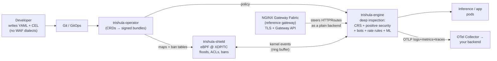

*Figure 0. The developer's view: everything is YAML; the operator compiles it; the shield and engine enforce it; NGF fronts it; OpenTelemetry narrates it.*

**The thesis in one line:** security wins when developers adopt it — mTLS, OAuth/OIDC, vaults, and ACLs all became ubiquitous because tooling made them easy for developers, **and the WAF is the last great security control that never crossed that bridge.** Trishula's purpose is to cross it.

<div class="pagebreak"></div>

## 1. Executive Summary

**The one-liner.** Trishula is an open-source, eBPF-accelerated web application firewall and API-protection system for Kubernetes: a per-node eBPF shield plus a userspace deep-inspection engine, governed by CRDs, fast enough to sit *inline* between a Gateway-API data plane and the application/model pools behind it. **NGINX Gateway Fabric (NGF) is the reference deployment** — open source end to end (Apache-2.0, NGINX core) — and every integration claim is validated against it before any other gateway is claimed.

**Why now.** Kubernetes-native HTTP ingress has consolidated around Gateway API, and AI-inference traffic is becoming its dominant workload: long bodies, streaming responses (SSE), token-metered endpoints, multi-tenant model pools. Its request shapes are adversarial surface — prompt injection, jailbreaks, training-data exfiltration, credential stuffing, and classic OWASP injection arrive on the same wire. The incumbent answers are either an out-of-band proxy hop with its own config language, or nothing. Neither is what developers can adopt.

**What it is.** Three independently deployable planes:

- **eBPF data plane (`trishula-shield`, DaemonSet).** XDP at the NIC: L3/L4 ACLs, SYN/UDP flood tarpits, verdict-cache and **ban-table** enforcement. TC on node/pod veths: flow classification, plaintext fast-path probes, ring-buffer events. Repeat offenders cost ~1 µs to drop in kernel instead of a userspace round-trip.
- **Userspace policy engine (`trishula-engine`, Deployment).** Full HTTP/1.1, HTTP/2, gRPC reconstruction and deep inspection: OWASP CRS evaluation via an embedded Coraza-compatible evaluator (SecLang import), a compiled Vectorscan matcher for the hot regex subset, a **CEL-based DSL over a structured request view**, OpenAPI 3.1 **positive-security** validation, **bot detection** (TLS/header/behavior fingerprints), **per-route rate limiting**, **score-based temporary bans**, and an in-band ML scorer with an async escalation path.
- **Control plane (`trishula-operator`).** `WAFPolicy` / `APISpec` / `RuleSet` / `BanPolicy` CRDs compile to signed bundles: evaluator chains, matcher DBs, kernel map values, ban thresholds. Hot reload ≤ 5 s, canary rollout, shadow mode for every change, OTel-native telemetry, CRS differential parity gate in CI.

**The reference deployment.** NGF terminates TLS at a Gateway API `Gateway`, and the AI/app routes steer to Trishula as a plain `backendRef` Service — exactly the shape any conformant implementation (Envoy Gateway, kgateway, Istio, Traefik) supports. Trishula is deliberately gateway-agnostic: NGF is where the contract is *proved*, not where it ends. A v2 ext_proc mode (§10.4) removes the proxy hop entirely on ext_proc-capable gateways.

**Differentiation, as specification.** The OSS WAF field is not empty — so "more than OSS WAF" is a feature list, not a slogan (§2.3, §4): (1) eBPF altitude with kernel-enforced bans; (2) positive security via OpenAPI; (3) bot/anti-automation detection; (4) specified, tunable, observable **temporary ban algorithms** — fail2ban-for-HTTP; (5) CRS parity enforced by a differential CI gate; (6) developer-first authoring with CEL; (7) OTel-everything; (8) a teach-the-web curriculum as a product feature.

<div class="pagebreak"></div>

## 2. Positioning & Non-Negotiable Design Decisions

These are **design decisions, not preferences**. They are how the project avoids the fate of every prior OSS WAF: a second nginx with rules.

### 2.1 D1 — Kubernetes-native: the WAF is CRDs, not config files

- Policy lives in `WAFPolicy`/`APISpec`/`RuleSet`/`BanPolicy` CRDs; there is **no nginx.conf equivalent** — no file mounts, no sidecar config language, no bespoke REST. `kubectl apply` (via GitOps or by hand) is the entire deployment story.
- CRDs adopt Gateway API's status-condition vocabulary (`Accepted` / `Programmed` / `ResolvedRefs`) so operators see one UX across the estate.
- Rules are RBAC-scoped, diffable, reviewable PRs — the same properties that made mTLS and OAuth policy manageable.

### 2.2 D2 — Gateway API is the traffic contract; NGF is the reference proof

- Trishula participates in traffic **as a Gateway API citizen**: a Deployment-backed Service behind `HTTPRoute` `backendRefs`, readiness-gated, health-checked, weight-steerable, canary-able. The gateway owns traffic strategy; the WAF never selects endpoints.
- **Reference deployment = NGINX Gateway Fabric.** Why NGF: NGINX-org-maintained and Apache-2.0; NGINX's data plane (h2c upstreams, TLS termination, BackendTLSPolicy) is production-hardened; NGF 2.x is Gateway-API-conformant and integrates the Gateway API Inference Extension (EPP) for model-pool steering; and its documentation patterns for attaching security stages (WAF policy attachment, guardrails processing) are the reference shapes for documenting a security stage on a Gateway. Trishula requires *nothing beyond conformant Gateway API* for its v1 contract — NGF is simply where it is proven first, with reproducible lab manifests.
- Portability is insurance, not marketing: §10.5 records the honest delta per gateway class. No commercial component sits anywhere in the reference path.

### 2.3 D3 — Detection depth: more than negative signatures

Signature matching (CRS) is the *baseline*, not the product. The shipped ladder adds five detection families CRS does not have:

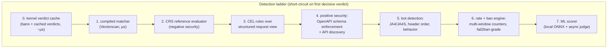

*Figure 1. Seven families; every compile artifact comes from one `RuleSet`/`WAFPolicy` source.*

- **Positive security (S4):** `APISpec` CRs wrap OpenAPI 3.1 docs per (host, route-prefix); enforce mode blocks unmatched paths/methods/param shapes; learn mode builds specs from live traffic and emits drift diffs. This is what commercial WAFs sell as their top-tier tier-1 feature and OSS rarely ships.
- **Bot detection (S5):** JA4/JA4S TLS fingerprints (terminated-hop observed), header order/entropy fingerprinting, per-source behavioral windows — feeding both per-request verdicts and the ban engine's score.
- **Rate + temporary bans (S6, §13):** the fail2ban-for-HTTP algorithm of §13 — specified, auditable, kernel-enforced for repeat offenders.
- **ML (S7):** local ONNX scorers inline, heavier judges async, verdicts cached and backfilled to kernel maps (§14).

### 2.4 D4 — Developer-first: the adoptability thesis

> *iptables/ACLs, mTLS, vaults, OAuth/OIDC, SSO — every security control that is now ubiquitous crossed into ubiquity by being made **usable by developers**. The WAF never did. WAFs stayed appliance-shaped: opaque rule languages, out-of-band consoles, config dialects. Trishula's founding hypothesis is that developer understandability **is** the security feature.*

Concretely, this thesis is enforced by five product properties:

1. **One language for custom logic: CEL.** Small, well-specified, K8s-native (used in admission control), Envoy-familiar, cost-budgeted, sandboxed. No new DSL to learn; `request.method == "POST" && request.body.?json.messages.size() > 128` is the whole rule.
2. **One config surface: CRDs + OpenAPI that developers already maintain.** Positive security is *derived* from artifacts API teams produce anyway — the spec they wrote for their SDK is the policy.
3. **One observability language: OTel.** Verdict traces, metrics, and (first-class) OTLP logs correlated by trace ID — read them in the backend the team already runs, not in a vendor console.
4. **Failure semantics you can explain in one sentence per route:** fail-open or fail-closed, chosen in the `WAFPolicy`, stated on a CRD condition, visible in the trace.
5. **Docs that teach the wire (§7):** every rule example links to *which bytes* it inspects — the docs double as an HTTP/2, TLS, QUIC curriculum. If a developer does not understand why a rule fires, the doc has failed, not the developer.

### 2.5 D5 — Honesty as a mechanism: shadow-first and differential parity

Every change (rule, schema, ML model, ban threshold) ships **shadow-first** with promotion gated on evidence (matches, FP delta). CRS compatibility is enforced by a verdict-level differential gate against the reference evaluator in CI and in production telemetry (§11.8). "Compatible" claims die quietly in every engine in this field; Trishula makes them CI failures instead. Performance targets are labeled targets until benchmarked (§17); visibility gaps per traffic shape are documented contracts, not footnotes (§9.7).

### 2.6 D6 — One project, several repos: `trishula-dev` + `trishula.dev`

- **Footprint, registered 2026-10:** GitHub org [`trishula-dev`](https://github.com/trishula-dev) and the domain [`trishula.dev`](https://trishula.dev) (apex parked at the registrar; site comes later). The upstream handle `trishula` is a dormant 2013 user account — not available; `trishula-dev` is the permanent org name and no aliasing layer is planned around it.
- **Repo split, not repo sprawl:** one product repo (`trishula-dev/trishula` — code, charts, operator, engine, shield), one site repo (`trishula-dev/website` — trishula.dev itself, static), and rules that live with the code, not on a fork: `rules/cel/` and `rules/exclusions/` ship inside the product repo so every shipped rule is parity-tested and versioned with the engine that runs it. Curated community sets graduate into a separate `trishula-dev/rules` repo when external contributions justify the review surface (Phase 1+ decision, not a Day-0 split).
- **Domain usage stays boring:** `trishula.dev` = docs/site + project links. No domain dependencies exist in the enforcement path: the API group is `trishula.security` (CRDs), images publish from `ghcr.io/trishula-dev/*`, and label/annotation prefixes are `trishula.shield/*` and `trishula.security/*` — those strings are contractual for downstream consumers and are not renamed to match the org handle.
- **The split is the governance boundary:** the product repo stays Apache-2.0 code-only (clean provenance for packagers and adopters); `website` and `rules` are separate review surfaces where content and community contributions evolve on their own cadence.

<div class="pagebreak"></div>

## 3. Problem Statement

### 3.1 The estate today

A Kubernetes cluster fronted by a Gateway-API data plane (the reference deployment uses NGINX Gateway Fabric):

- **Gateway tier:** TLS termination, Gateway/HTTPRoute routing, L4 edge protections — conformant Gateway API, h2c backends, weighted steering, Inference Extension (EPP) for model pools in AI estates.
- **Application/model pools:** Deployments speaking HTTP/1.1, HTTP/2, or gRPC — increasingly AI inference with long bodies, SSE streaming, token-metered endpoints.
- **A WAF, somewhere, awkwardly:** either an external proxy hop with its own config language, or — in the majority of dev-run clusters — *nothing*, because WAFs are that bad to adopt.

### 3.2 The problems, enumerated

| # | Problem | Consequence |
|---|---------|-------------|
| P1 | The WAF is a separate proxy hop on the app path | Extra latency, extra TLS/keepalive fanout, a second scaling unit, config surface nobody on the app team owns |
| P2 | Two configuration languages per security change (app manifests + WAF directives) | Security changes leave GitOps; drift between envs; the WAF console becomes shadow infrastructure |
| P3 | Rules are not Kubernetes-native | No GitOps diff, no RBAC-scoped authoring, no canary of a rule change, no CRD status |
| P4 | The WAF cannot see kernel-level context | Connection-level abuse (slowloris, credential stuffing across connections, floods, bot patterns) is evaluated per-request only — or not at all |
| P5 | OSS WAF depth stops at negative signatures | No positive security, no API discovery, no bot/anti-automation defense, no rate-based ban workflows — the features that separate a WAF from a regex filter |
| P6 | AI traffic has unmet detection needs | Prompt-injection/jailbreak and exfiltration semantics are invisible to regex-era rules; ML is bolt-on rather than in-band |
| P7 | The developer experience is hostile | Rules are written in vendor dialects, tuned over weeks, opaque to the people whose APIs they protect; the practical outcome is that **devs skip the WAF entirely** |
| P8 | Temporary bans are ad hoc | Every OSS remedy is a shell script grepping logs (or fail2ban on nginx logs — log parsing on tap for a wire problem); no spec, no observability, no kernel-speed enforcement |

### 3.3 Why not: the alternatives, honestly

- **Keep an nginx WAF tier (ModSecurity/NGINX-App-Protect-class):** solves none of P1–P8; it *is* P1/P2/P3/P7. ModSecurity itself is EOL on nginx[316] and libModSecurity is maintenance-mode[318]; the OSS community's CRS work has pivoted to Coraza[310].
- **Cilium + Envoy:** excellent network policy and L7 authorization, but not a WAF — no CRS evaluation, no body-inspection depth, no security rule lifecycle, no bot defense. Its *architecture* (eBPF fast path + userspace L7 proxy) is the validated pattern this design borrows deliberately[85][87].
- **Commercial cloud WAAP:** contradicts the open-source, self-hosted requirement; sends payloads to third-party inspection — a non-starter for model payloads and regulated estates.
- **open-appsec / SafeLine (OSS ML WAFs):** closest prior art in detection depth — open-appsec couples a learning engine to enforcement with CRDs but through a central management plane[192][239]; SafeLine is container-nginx-shaped with a semantic pipeline[196][205]. Neither has an eBPF data plane, neither speaks the Gateway-API steering contract, and neither treats developer comprehensibility as a design target.
- **fail2ban / CrowdSec style remediation:** the right *idea* (score behavior, ban temporarily, unban on evidence) applied at the wrong altitude — log parsing after the fact, filesystem state, no HTTP-native view, no per-route policy. Trishula moves the idea onto the wire, into the kernel, and into the CRD (§13)[145][147].

### 3.4 Target users

- **Application/ML platform developers (primary):** declare `APISpec` and `RateLimit/BanPolicy` for their own endpoints; read verdict traces; write CEL rules. They should never need to learn a WAF dialect.
- **Security engineering:** curates `RuleSet` CRs and CRS bundles; tunes in shadow mode; owns detection quality telemetry.
- **Platform/SRE:** steers routes via Gateway API; scales Trishula like any Deployment/DaemonSet; owns the SLO dashboards.

<div class="pagebreak"></div>

## 4. Related Work — What We Borrow, Where We Sit

*(The WAF-shaped core is surveyed here; the wider field — eBPF-native security tools, runtime-enforcement platforms, gateway/plugin stacks, and the temporal-ban lineage — is surveyed in Appendix E with a per-project "why we did not build on it".)*

### 4.1 The field, in one table

| Project | Engine | Rules / Detection | ML | K8s shape | Developer DX |
|---------|--------|-------------------|----|-----------|--------------|
| Coraza | Go library | CRS-compatible (SecLang), WASM plugins[133][134] | no | embed / Caddy module / HAProxy SPOA | lib-first; you write glue |
| ModSecurity (libMOSC v2) | C library | CRS native | no | nginx/Apache module | EOL on nginx[316]; maintenance mode[318] |
| SafeLine | container stack (nginx core) | signatures + semantic pipeline | semantic + optional LLM | docker-compose first | panel-first; nginx underneath[196][209] |
| open-appsec | attachment + central engine | positive security + signatures | 2 ML models + context | K8s CRDs, central mgmt | CRDs yes; central plane couples you[192][239][241] |
| BunkerWeb | nginx-based | CRS + own | no | containers | template-first |
| CrowdSec | Go agent + remediation comps | own rules + CRS bridge; community blocklists; bot detection[145][170] | community IP intel | agent + local API | great CLI story; log-tap altitude |
| fail2ban | log-parsing daemon | pattern → temporary ban | no | host services | the UX archetype for bans, on the wrong altitude[147] |

### 4.2 What Trishula borrows (with credit)

- **Coraza as embedded reference evaluator** — composition, not fork: CRS/SecLang parity, WASM extension surface[134][154][312].
- **open-appsec's learning→enforcement lifecycle** shape — minus the central-plane coupling[239][237][241].
- **SafeLine's staged semantic pipeline** — cheap deterministic stages before heavier semantic analysis[205][206].
- **CrowdSec's community telemetry idea** — crowd blocklists as one ban-engine input; optional, CRD-gated[145][170].
- **fail2ban's temporal ban UX** — score thresholds, temporary bans with expiry, evidence-driven unban; re-specified for HTTP at wire speed (§13)[147].
- **Cilium's two-plane architecture** — eBPF fast path + userspace L7 proxy, the proven decomposition for exactly this problem[85][87].

### 4.3 Where Trishula sits — the gap no project occupies today

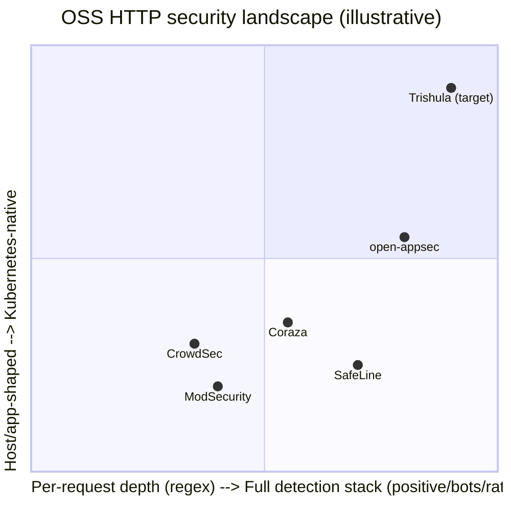

*Figure 2. Trishula's target quadrant: a full detection stack, Kubernetes-native, with kernel altitude — and authored by developers.*

- **One rule surface compiles across altitudes** (kernel maps + matcher DB + evaluator chain) — no OSS WAF fans out like this.
- **eBPF shield as a first-class component** (shield-only mode hardens paths that keep their existing gateway).
- **Gateway-API-native steering posture** proved on NGF.
- **CRS differential parity as a product feature** (§11.8), not a test footnote.
- **Specified temporary-ban algorithm with kernel enforcement** (§13) — absent from every project in the table above.
- **A teach-the-web curriculum as a deliverable** (§7) — SPIFFE/SPIRE treated docs as the product; no WAF has ever done this.

<div class="pagebreak"></div>

## 5. Developer Experience Charter

The charter is testable: each commitment below has a CI check or an acceptance test. If it breaks, it is a bug with the same severity as a detection miss — because the thesis of §2.4 is that *understandability is the security feature*.

| # | Commitment | Test that enforces it |
|---|-----------|----------------------|
| DX1 | A developer's first custom rule ships in ≤ 15 minutes from `git clone` (lab: kind + NGF + Trishula + one CEL rule, fixture-verified) | CI runs the lab script nightly; timing asserted |
| DX2 | Every CEL rule error message names the offending field and suggests the structured-view path | fixture corpus → assert error text shape |
| DX3 | Every documented rule links to the wire-level explainer (§7) for the fields it touches | docs lint: backlink check per example |
| DX4 | No rule requires vendor-dialect knowledge (no ModSec directives exposed unless importing CRS) | docs lint + API review gate |
| DX5 | A blocked request surfaces a self-explaining verdict: rule ID, plain-language reason, link to the rule's doc + fixture request | golden trace tests over verdict telemetry |
| DX6 | Removing Trishula returns the cluster to the pre-install state with zero kernel residue | uninstall CI job runs `bpftool` assertions |
| DX7 | All docs examples run — fixtures are CI-executed, never decorative | fixture runner over docs corpus |

The developer's path, in one picture:

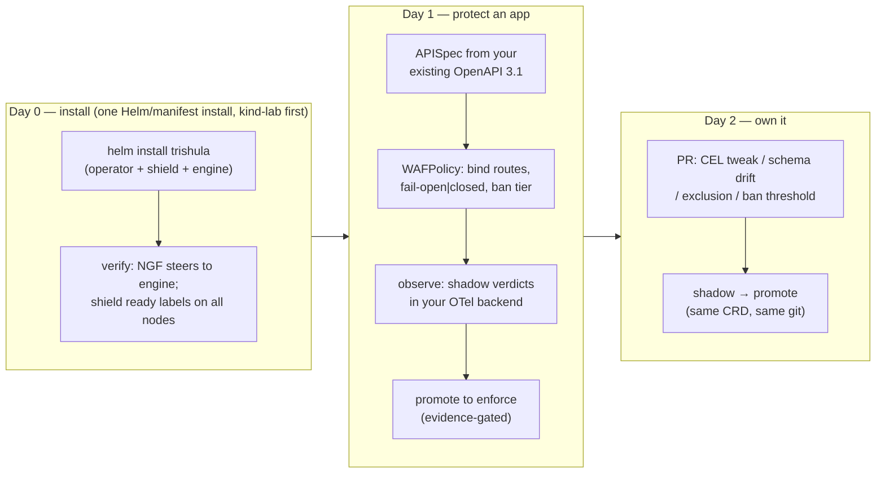

*Figure 3. The adopter lifecycle the deliverables must support — no step may require leaving Kubernetes or Git.*

<div class="pagebreak"></div>

## 6. Vision, Goals, Non-Goals

### 6.1 Vision statement

> Every HTTP request entering a Kubernetes cluster is inspected at line rate by policy that lives in Git and is understood by the developer who wrote the API — shielded by eBPF before it costs a scheduler tick, evaluated by an engine that speaks CRS, positive-schema, bots, rates, and ML in the same breath, and steered by any Gateway-API data plane like any other backend.

### 6.2 Goals

**G1 — Inline without a proprietary hop.** Trishula sits between the gateway and pools as a Deployment-backed Service; any conformant Gateway-API implementation can steer to it. **NGF is the reference proof, validated in CI.**

**G2 — eBPF speed where it counts.** XDP/TC fast path: L3/L4 ACLs, flood defense, cached verdicts, and **ban-table enforcement** in kernel; deep inspection in userspace co-located on the same node behind a shared ring buffer. Targets in §17.

**G3 — CRS compatibility as the correctness baseline.** Import and evaluate OWASP CRS (incl. SecLang) with verdict-level parity (§11.8) *and* a compiled fast-path matcher for the hot subset; differential shadow mode guarantees the fast path never regresses against the reference evaluator.

**G4 — A rule language engineers actually want.** CEL over the structured request view; SecLang import for the CRS estate; hot reload via CRD apply; cost-budgeted evaluation.

**G5 — Positive security.** OpenAPI 3.1 schema enforcement with discovery/learn mode and drift telemetry — derived from specs developers already maintain.

**G6 — Bot defense and anti-automation.** JA4/JA4S, header-order/entropy fingerprints, behavioral windows, per-detector verdicts feeding both inline decisions and the ban engine (§12).

**G7 — Rate limiting and temporary bans as specified mechanisms.** Multi-window sliding rates, score-based temporary bans with expiry and evidence-driven release — fail2ban-for-HTTP, kernel-enforced for repeat offenders (§13).

**G8 — ML with a clean hand-off contract.** Feature views derived from engine + eBPF events; local ONNX scoring in-band (< 1 ms); heavier semantic judges async with verdict caching (§14).

**G9 — Observable by default, in OTel.** OTLP traces, metrics, *and logs*; every verdict a correlated span; shields export kernel counters; per-route dashboards ship in-repo (§15).

**G10 — Teach the web.** The docs, labs, and curriculum of §7 are a paid deliverable of the project, SPIFFE/SPIRE-style.

### 6.3 Non-goals (v1)

- **Not a TLS-terminating edge LB** for the whole estate: the gateway owns termination in the reference deployment; Trishula inspects post-termination plaintext (re-encrypting engine termination is a secondary, feature-gated mode).
- **Not a Service Mesh:** east-west policy stays with Cilium/network policy; Trishula is the north-south + steering-path control.
- **Not a secrets/token vault:** Trishula references JWT claims; it does not store or tokenize.
- **Not an endpoint-picker:** model-pool selection stays with EPP/the gateway; Trishula transparently proxies preserving downstream selection.
- **No Windows/other-kernel ports** in v1: Linux (XDP/TC) only.
- **No vendor console:** there is no Trishula web UI in v1 — the CRDs, kubectl, and your OTel backend *are* the console. (A read-only dashboard preset ships as Grafana JSON, not an app.)

### 6.4 Success metrics

| Metric | Target (v1) |
|--------|-------------|
| Added latency, inline vs direct (p99, full CRS + 8KB body) | ≤ 1.5 ms |
| Fast-path verdict (cached block/allow/ban, kernel) | ≤ 100 µs added |
| Throughput per engine replica (4 vCPU, CRS + schema) | ≥ 10k req/s |
| Shield drop rate (XDP, native driver, commodity 25G NIC) | ≥ 10 Mpps/core |
| CRS verdict parity vs reference evaluator on CRS test suite | 100% applicable rules |
| False-positive-rate delta vs plain CRS defaults | ≤ 0 (parity baseline) |
| ML local verdict overhead (in-band ONNX, CPU) | ≤ 1 ms p99 |
| Time-to-enforce a `RuleSet` CR (apply → all replicas) | ≤ 5 s |
| DX1 lab time (clone → first enforced rule) | ≤ 15 min |
| Docs examples CI-executed | 100% |

<div class="pagebreak"></div>

## 7. Teach-the-Web Curriculum

The SPIFFE/SPIRE lesson: the project that explains *why the wires work* becomes the reference implementation people trust. Trishula's docs therefore include a curriculum, delivered as a docs section + runnable labs (kind clusters with scripted scenarios), maintained **in-repo** with the same CI as product code.

### 7.1 Curriculum map — what each layer of the product teaches

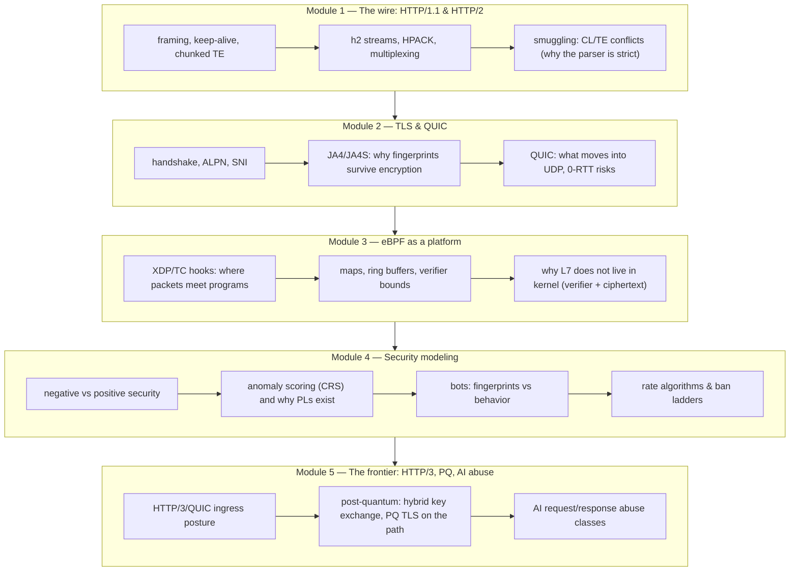

*Figure 4. Five modules, each anchored to a real component a learner can `kubectl` into.*

### 7.2 The pedagogy rules

- **Every rule example cites its wire anatomy.** A CEL rule on `request.headers` links to the header explainers (Module 1); the JA4 bot rule links to Module 2's fingerprint lesson; §13's ladder links to the rate-algorithm lesson (token bucket vs sliding window vs EWMA, with interactive fixtures).
- **Labs are runnable clusters,** not diagrams: `lab/` scenarios replay recorded adversarial traffic against live kind clusters (Module 1's smuggling corpus is exactly the differential corpus of §11.8).
- **The product is the textbook:** when a rule fires, the verdict's trace metadata carries the module link (DX5) — learning happens at incident time, which is when developers actually read.
- **PQC is in scope from v1 of the docs** (not the data plane): the curriculum explains Kyber/hybrid key exchange (X25519+ML-KEM, the IETF-standardized hybrid group [324], default in mainstream TLS stacks and browsers since 2024–2025 [325][326]), where it sits on Trishula's path (termination happens at the gateway; PQ affects the gateway↔client handshake and gateway↔pool mTLS choices; Appendix A states the four product-side notes), what it does to ClientHello size and JA4 fingerprints [327][328], and what a WAF must not assume about payload visibility under future TLS revisions.

### 7.3 Deliverables

| Deliverable | In | Version |
|------------|----|---------|
| Five teaching modules (docs) | `docs/academy/` | v1 at Alpha |
| Kind-lab scenarios + fixtures | `lab/` | v1 at Alpha (Modules 1, 3, 4), Modules 2, 5 by GA |
| "Why did this block?" verdict-doc generator | engine | ties verdict → rule → module (§15 OTel schema) |
| Adversarial corpora as teaching sets | `test/corpora/` | shared with §11.8 differential suite |

<div class="pagebreak"></div>

## 8. Architecture

### 8.1 Design principles

1. **Kernel does the cheap thing; userspace does the smart thing.** Every packet pays at most one XDP/TC hook; anything needing full HTTP pays the ring-buffer hop once, then lives in userspace where the rule engine loops freely.
2. **One policy artifact, many enforcement altitudes.** A `RuleSet` compiles simultaneously to (a) userspace evaluator chains, (b) a Vectorscan matcher DB for the hot subset, (c) kernel map values — ACLs, verdict caches, **ban tables** — and (d) OTel counters. One source of truth, no drift.
3. **Steering belongs to the gateway.** Trishula never selects endpoints; it is a steerable, health-checked backend under any conformant Gateway-API implementation. Weights, canaries, session persistence stay in Gateway API land.
4. **CRDs are the only config surface.** No file mounts, no sidecar config, no bespoke REST; `kubectl apply` is how a rule deploys.
5. **Every change can run in shadow.** New rules, ML models, schema versions, ban thresholds evaluate verdict-only first; promotion requires evidence (matched-count, FP delta).
6. **Fail-open or fail-closed is a per-route CRD choice** (default fail-open in shield mode; per-`WAFPolicy` inline).

### 8.2 Component map

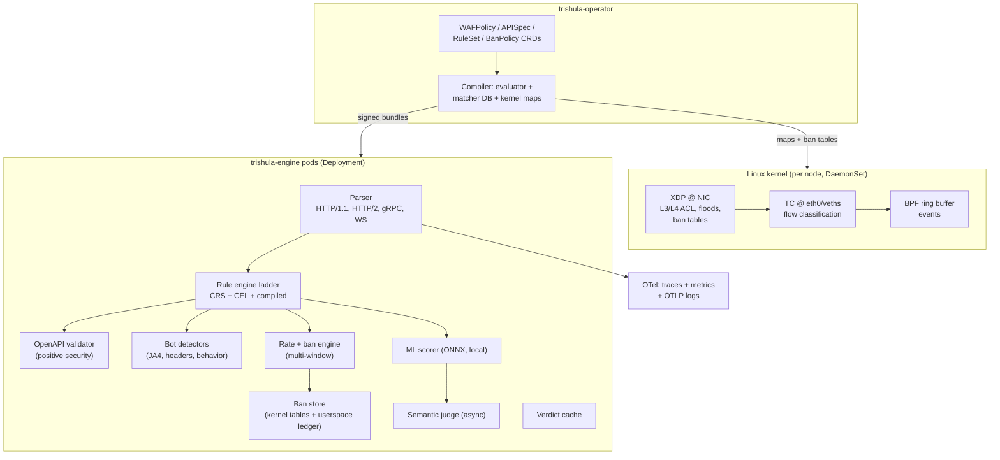

*Figure 5. Component map: per-node shield, userspace engine, CRD compiler — ban state flows kernel-ward for line-rate enforcement.*

The stack is deliberately three deployables:

- **`trishula-shield` (DaemonSet, privileged).** Loads/attaches XDP at the NIC and TC at node/pod interfaces (cilium/ebpf Go loader, CO-RE objects), owns the XDP shield, flow classification, and kernel ban-table enforcement, exports the ring buffer and pinned maps. Host-network pod; no service port.
- **`trishula-engine` (Deployment + Service).** The userspace WAF: terminates the steering hop (plaintext from the gateway, or TLS it re-terminates itself in secondary mode), runs the full ladder (§2.3), forwards upstream. Horizontally scalable; each replica drains the co-located shield's ring buffer (verdicts are content-keyed, so per-flow affinity is unnecessary).
- **`trishula-operator` (Deployment).** Watches CRDs, compiles bundles (userspace + matcher DB + map values + ban thresholds), rolls them via a signed bundle API, manages shadow lifecycle, exposes status Conditions, records FP-feedback telemetry.

### 8.3 Request lifecycle

1. **Client → Gateway.** The gateway (reference: NGF) terminates TLS, applies edge policy, matches the `HTTPRoute`.
2. **Gateway → Trishula Service.** Protected routes' `backendRefs` point at `trishula-engine`; the gateway health-checks it like any backend.
3. **Trishula ingress hook (TC).** The same-node TC classifier tags the connection, feeds pre-connection metadata (SYN rate, ban-table hits, source reputation) into the engine cheaply.
4. **Engine parse** → structured request view → **evaluation ladder** (§2.3): kernel-cached verdicts/bans (hit ≈ no-op), compiled matcher (µs), full CRS evaluation, CEL rules, schema validation, bot scoring, rate/ban checks, ML scoring — short-circuiting on the first decisive verdict by the policy's action precedence (`block > challenge > log > pass`; SecLang `matcaction` overrides preserved for imported rules).
5. **Verdict** → allow: forward upstream (transparent proxy, preserving end-to-end headers/metadata — no endpoint-picking logic lives here); block: emit local response (per-route configurable body, `429` for bans with `Retry-After`); challenge: issue evidence request (§13); log/shadow: mark and continue.
6. **Response path.** Response headers/bodies re-inspect on the response chain (CRS phase 4), streaming-aware with bounded chunk buffering; exfiltration patterns checked on chunk boundaries.
7. **Telemetry.** One OTel span per request across all stages; kernel counters exported every tick; every verdict carries rule IDs, phase, and score ladder (§15).

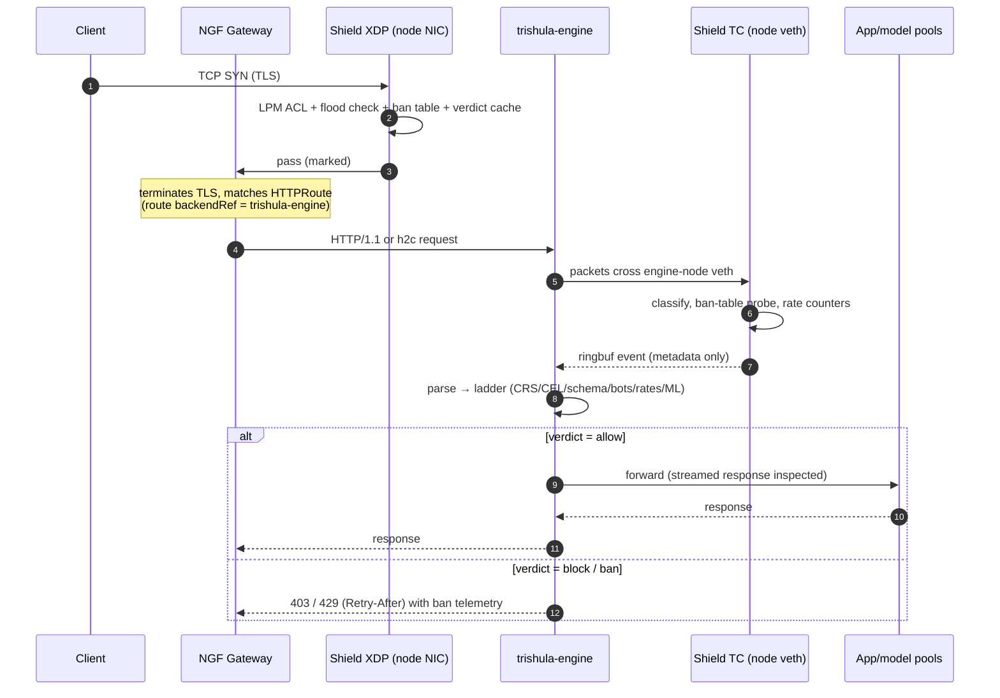

*Figure 6. Inline path: the kernel plane touches the flow at two altitudes; the engine owns decisive inspection; bans feed back kernel-ward (dashed return paths omitted for legibility).*

### 8.4 Operating modes

- **Shield-only:** DaemonSet alone; XDP/TC drops obvious L3/L4 abuse, enforces ban tables, and (on plaintext legs) trivial L7 patterns; zero proxy hop; drop-in hardening of any existing path.
- **Inline (v1 default for protected routes):** full engine as the steered backend.
- **Shadow-parallel:** engine evaluates but forwards regardless; used for CRS-import confidence, rule canary, ML learning, migration diffs.
- **Schema-learn:** APISpec discovery from live traffic, emitting OpenAPI diffs for review.

### 8.5 Deployment topologies

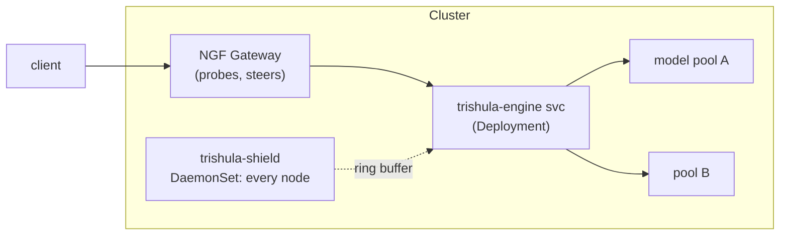

*Figure 7. Topology: gateway front door, engine as steered backend, shield on every node.*

Two supported placements: **(a) dedicated engine tier** (Deployment sized for throughput; v1 ships this — simplest scaling story), **(b) fused sidecar** (engine container beside the gateway container, shared loopback; lowest latency, more coupling — a v2 option). The shield DaemonSet is mandatory in both.

<div class="pagebreak"></div>

## 9. eBPF Packet Path

### 9.1 The two-plane principle

Trishula splits inspection by altitude:

- **Kernel plane (shield):** bounded, allocation-free, verdict-cheap. L3/L4 ACLs, flood defense, ban-table enforcement, flow classification. Every packet pays O(1) here; most packets are classified and only counted.[60][61]
- **Userspace plane (engine):** unbounded parsing freedom (loops, allocs, regex, ML) in a language with an ecosystem (Go). Full HTTP reconstruction happens exactly once per request, here.

What the kernel deliberately does **not** do: full header walks, body parsing, regex evaluation, TLS. Two hard reasons: verifier boundedness (loops/instruction budgets make real L7 parsing a tail-call gymnastics project with poor maintenance economics)[96][106][105], and the ciphertext problem — at the NIC, HTTP(S) payloads are TLS records;[79] decisive L7 analysis requires post-termination plaintext. The kernel plane still gets a *bounded* plaintext fast path (§9.6) on legs where the gateway already terminated TLS — but never depends on it.

### 9.2 Hook inventory

| Hook | Where | v1 duties | Later |
|------|-------|-----------|-------|
| **XDP (native/generic)** | shield node NICs | L3/L4 ACL (LPM trie maps), SYN/UDP flood tarpits, verdict-cache + **ban-table** enforcement, IPv4/IPv6 normalization | AF_XDP for shield-only mode, cpumap steering |
| **TC ingress/egress** | engine-node veths + node eth0 | flow classification, mark-based steering recognition, per-flow behavioral counters, plaintext fast-path probe, ringbuf events | sockmap/sk_msg redirect for same-node acceleration |
| **cgroup/connect hooks** | engine pods | upstream connect-time policy (pool allow-list), connect marks | — |
| **kprobes** | nodes (observability) | conntrack quality, retrans/RTT hints for behavioral DoS | — |
| **uprobes** | optional, per-workload | SSL_read/SSL_write tracing where termination happens inside an app pod | Go crypto/tls uprobes |

All C compiled CO-RE (vmlinux.h via `bpftool btf dump`), loaded by the Go shield with cilium/ebpf; objects generated in-CI via bpf2go so a tagged release ships byte-identical objects.[94][126][95]

### 9.3 Maps and state

| Map | Type | Size | Producer → Consumer |
|-----|------|------|---------------------|
| `acl4`/`acl6` | LPM trie | 1M prefixes | operator → shield (compiled from CRDs) |
| `verdict_cache` | LRU hash | 1M entries, TTL | engine → shield (block/allow with expiry) |
| `ban_table` | LRU hash + array | 1M entries, TTL | **ban engine → shield** (banned keys with expiry + reason code) |
| `src_rep` | LRU hash | 256k, scored | engine → shield (reputation: stuffing scores, bot scores) |
| `flow_stats` | LRU hash | 256k | shield → shield (per-flow seg/byte counters, slowloris math) |
| `rate_windows` | per-CPU array + LRU | — | shield (SYN/req-rate EWMA per prefix — kernel-side rate accounting) |
| `events` | ringbuf | 16 MiB/node | shield → (co-located engine or relay) |

Cross-pod sharing: shield pins maps on host BPFFS (`/sys/fs/bpf/trishula/`); engine pods node-affined to shield nodes mount BPFFS read-write (hostPath) and open pinned maps/ring directly — zero network hop for co-located engines. Non-co-located engines receive events via the shield's gRPC relay (sampled under load). **Verdict authority stays userspace:** the engine computes, the shield enforces (open question §20.3.3; the kernel stays decision-free).

### 9.4 Ring buffer sizing and backpressure

Ring events carry a fixed 128B header + optional bounded slices (path hint, JA4-style fingerprint fields). Sizing: 16 MiB default; the relay samples (1/2^k) when consumers lag, with an always-sampled high-priority class (ban writes, cache hits, block decisions). The ring is never the payload path (§9.1), so loss is a telemetry-quality issue, surfaced as `trishula_shield_ring_dropped_total`.

### 9.5 Kernel-side rate accounting (feed §13)

The shield maintains cheap per-source EWMA counters (`rate_windows`) sampled at XDP/TC — SYN rates, UDP rates, post-termination request-start rates on plaintext legs. These are *inputs* to the engine's ban algorithm (§13.3) and a *fast-path veto*: when the engine writes a ban, the kernel enforces it without further userspace consultation. Kernel counters alone never issue a ban — they escalate evidence (a SYN-flood EWMA burst pre-scores the source for the engine's decision).

### 9.6 Plaintext fast path in kernel (bounded, honest)

After gateway termination, requests crossing engine-node veths are plaintext; the TC hook can safely, within verifier budget:

- match method via 4-byte load compare (`GET `, `POST`, `PUT `, …) on the first line;
- path-prefix gate via LPM/trie map keyed on the first N bytes (engine-compiled allow/deny/observe per route prefix);
- detect obvious anomalies (first-line oversize, missing version token, bare 0x00/CR in method, duplicate CL headers in the bounded window);
- tag the event with a `fastpath` classification so the engine can skip redundant parsing for allow-listed prefixes.

It cannot: walk all headers, parse bodies, evaluate regex. Every fast-path classification is advisory — the engine re-parses authoritatively, and kernel-vs-engine classification diffs feed the §11.8 parity gates.

### 9.7 Visibility contracts per mode

| Traffic shape | Shield sees | Engine sees |
|---------------|-------------|-------------|
| Gateway-terminated (reference) | ciphertext + flow metadata | full plaintext |
| Plaintext north-south HTTP | full plaintext (fast path §9.6) | full plaintext |
| Re-encrypted engine→pool (secondary mode) | ciphertext | full plaintext (engine terminates the steering hop) |
| kTLS/app-internal TLS (no proxy hop) | ciphertext + metadata | nothing — documented gap; optional uprobes restore visibility per workload |

**TLS visibility without keys (posture):** eBPF cannot decrypt TLS without key custody — record framing is visible, payload bytes are not, and no kernel mechanism changes this. Two operating models follow. **Model A (kernel plaintext via kTLS handoff):** where Trishula owns TLS termination (the engine's re-terminating secondary mode, §6.3; or mTLS between pods), the control plane performs the handshake, holds the session keys, and hands Tx/Rx crypto state to the kernel (`TLS_TX`/`TLS_RX` ULP); `strparser` + the socket layer then observe decrypted, message-delineated plaintext, and the full fast path of §9.9 applies — at the documented cost of kernel-resident session keys (threat model, blast radius, rotation are part of the §9.9 design note gate). **Model B (no-key):** when termination is external to Trishula, kernel-side detection is metadata-only — `ClientHello` is pre-encryption (SNI, ALPN, JA3/JA4 fingerprint bytes), plus certificate-chain metadata and TLS record framing (sizes, timing) for behavioral and rate/ban policy. Header/body policies, CRS payload evaluation, and positive-schema checks are unavailable in Model B; enforcement is limited to connection- and fingerprint-level verdicts. Extracting keys from application memory out-of-band (SSLKEYLOGFILE-style harvesting) is an anti-pattern and explicitly out of design scope.

### 9.8 Go-side stack choices

- cilium/ebpf for loading/pinning/map I/O; bpf2go for compile-in-CI; `testenv` for verifier tests.[94][126]
- Ring reader: per-CPU batching channel → transaction assembler; zero-copy where the API allows; single allocation per request in the hot path target.

<div class="pagebreak"></div>

### 9.9 Socket-plane L7 fast path (tracked evaluation, not a v1 commitment)

The §9.1 principle keeps the kernel decision-free; a complementary option exists one altitude up, at the socket layer, where the stack already provides TCP reassembly and TLS record processing. This subsection specifies the tracked evaluation: what could be offloaded, under which constraints, and what it must not claim.

**Mechanism (precedent: Beeline synthesis):** data planes attached at `SK_SKB` (ingress/egress) and `SK_MSG` (local) with `strparser` delineating application-layer messages; kTLS handoff (Model A, above) supplies decrypted plaintext where termination is Trishula-owned. Policies are synthesized into per-policy `Parse–Match–Action` eBPF programs: DFA-based header extraction into a bounded header vector, compiled `if`-chain matching, and a small action-template library (`compare`, `read/write`, `en/decode`, `en/decrypt`, `hash`, `get/set`, `forward`, `drop`) — every action sequence terminating in `drop` or `forward`. Published results for this class of design: 89% of observed L7 service-mesh policies enforceable without kernel changes; up to 6× median request-latency reduction and 3× throughput versus a service proxy accelerated with an L4 fast path; ≥39% throughput advantage at the maximum offloadable policy complexity.

**What Trishula would offload (policy subset):** JWT HS256 authentication (`issuer`/`audience` claims), RBAC allowlists (source IPs, ports, paths), route, telemetry counters, and header mutation — all classes already named in §11's ladder, all header-class, body-free. CRS/Coraza body evaluation is *never* kernel work: the fast path is an enforcement layer for header-class policies, not a kernel WAF.

**Architecture integration:** the fast path consumes the same single compiled bundle (§8.1.2) — a WAFPolicy subset compiles to policy-specific eBPF templates while the rest routes transparently to the engine slow path (fail-open at socket altitude: parse error or match miss forwards; the fast path never silently drops on its own failure). Verdict/ban state shares the §9.3 maps so XDP and socket planes enforce one verdict authority. The kernel-module dependency is a gate: hash/encode helpers are absent from the eBPF runtime on current kernels (upstream kfunc coverage evolving; a minimal out-of-tree module is the interim precedent with its own supply-chain/verifier-CI cost — adopt/adapt/skip is decided in the design note, not assumed).

**Recorded constraints:** HTTP/2 requires header-cache disabled on workloads (Huffman coding stays supported); stream-wise routing means frames with ambiguous destinations (push promise, connection-wide flow control) fall to the control plane; non-event-driven policies (health checking) and body (de)compression classes route to the slow path; HTTP/3/QUIC is out of scope with the rest of the kernel-side HTTP/3 posture (Appendix A).
- All kernel numbers (Mpps-class XDP figures, ring latency) trace to Appendix C sources;[60][75][72] internal budgets are targets pending PoC validation (§17).

<div class="pagebreak"></div>

## 10. Gateway API Integration — NGF Reference Deployment

### 10.1 Why NGF, specifically

The reference deployment must be all-OSS and boring in the right places. **NGINX Gateway Fabric (NGF):**

- open source (Apache-2.0, NGINX core data plane), maintained under the NGINX org with an active release train (2.x line; 2.7 is fully conformant with Gateway API 1.6 and added `HTTPExternalAuthFilter` and TLS listener `Terminate` mode)[F-ngf27];
- hardened NGINX data plane with h2c upstreams, weighted `backendRefs`, header/canary matches — everything Trishula's steering contract needs is core HTTPRoute semantics;
- documented integrations for exactly the two patterns Trishula composes with: security stages attached to routes (the WAF-for-NGINX policy attachment pattern, `securityLogs` pipelines)[254][301] and the Gateway API Inference Extension (EPP) for model-pool steering[39];
- a documentation style (per-feature how-tos with manifests) that Trishula's own reference docs imitate so developers can copy-edit rather than translate.

Trishula requires **no NGF-specific features** for v1: everything below is conformant Gateway API. NGF is where the contract is proven, versioned, and broken-test-guarded. The same manifests run on other conformant data planes (§10.5).

### 10.2 The contract: Trishula as a Gateway API citizen

Every protected route expresses its relationship to the WAF in ordinary Gateway API objects:

```yaml
apiVersion: gateway.networking.k8s.io/v1
kind: HTTPRoute
metadata:
  name: chat-completions
  namespace: ai-platform
  annotations:
    trishula.security/policy: chat-completions   # explicit policy binding
spec:
  parentRefs:
    - name: edge-gateway                          # NGF GatewayClass
  hostnames: ["api.example.com"]
  rules:
    - matches:
        - path: { type: PathPrefix, value: /v1/chat }
      backendRefs:
        - kind: Service
          name: trishula-engine                   # Trishula is the backend
          port: 8080
          weight: 100                             # canary ramps are ordinary weight edits
        - kind: Service
          name: chat-completions-pool            # (managed below the engine — see topology note)
          weight: 0
---
apiVersion: v1
kind: Service
metadata:
  name: trishula-engine
  annotations:
    appProtocol: kubernetes.io/h2c                # h2c to the engine
spec:
  selector: { app.kubernetes.io/name: trishula-engine }
  ports: [{ name: http2, port: 8080, appProtocol: kubernetes.io/h2c }]
```

Contract terms, each CI-tested against NGF[39][249]:

1. **Steering:** the gateway steers to `trishula-engine` as it would to any Service — weighted `backendRefs`, header matches, canary weights. Trishula never selects endpoints. (In the reference topology the engine forwards to the pool Service; pools that use the Inference Extension keep their EPP machinery downstream of the engine — §10.4.)
2. **Health:** engine readiness = current bundle load state (not process liveness); unhealthy replicas leave the Service's endpoints, and the gateway's endpoint tracking removes them from rotation automatically.
3. **Failure semantics per route:** `failOpen` (engine down → gateway routes direct to the pool via weight-0 fallback `backendRef`) or `failClose` (drop). One vocabulary across the path, mirroring the EPP contract's FailOpen/FailClose[41][43].
4. **Protocols:** h2c engine ingress (`appProtocol: kubernetes.io/h2c`); gRPC framing recognized; TLS termination is gateway-owned (listener `tls.mode: Terminate`), so the engine sees plaintext (§9.7).
5. **Binding:** policy attaches via HTTPRoute annotation `trishula.security/policy: <name>`, or namespace-scoped `WAFPolicy.routeSelectors` — most-specific wins; `Bound`/`UnresolvedRef` Conditions in CR status mirror Gateway API conventions.

### 10.3 The reference walkthrough (the lab every claim is proven in)

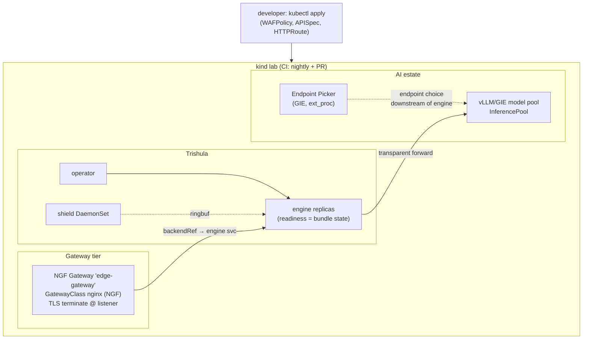

*Figure 8. The CI-proven reference: kind + NGF + Trishula (+ EPP where AI routes need it).*

The lab proves, in CI: NGF steers weighted traffic to the engine; readiness flips remove/add engine endpoints; a `429` ban response with `Retry-After` traverses NGF unmangled; h2c upgrades; TLS termination leaves plaintext at the engine; shadow vs enforce verdict parity; uninstall leaves zero kernel residue (DX6). The kind→k3s→managed-K8s progression is the documented adoption path — the same manifests, bigger cluster.

### 10.4 Beyond the proxy hop: ext_proc (v2) and the Inference Extension

- **ext_proc stage (v2, feature-gated).** Envoy-family data planes (Envoy Gateway, kgateway, Istio/agentgateway) can call out to an `ExternalProcessor`; Trishula's engine ships this server from Phase 0 (one binary, two transports), so ext_proc-capable estates get a **no-proxy-hop** WAF: headers/body chunks arrive as gRPC frames, the engine returns verdicts/mutations/dynamic metadata. Wire contract fixed in §19.1. NGF is the reference for Variant A today; ext_proc estates activate v2 with the same engine.
- **Inference Extension ordering.** On EPP-enabled routes (NGF + GIE integration[39]), EPP runs as its own ext_proc stage alongside the gateway. Filter ordering (WAF before/after EPP) is per-gateway configuration — not standardized upstream; the operator emits the ordering snippet per estate. WAF-before-EPP saves EPP/queue capacity on block; EPP-before-WAF lets verdicts use the selected-endpoint class as policy input. Either order, `x-gateway-destination-endpoint` metadata passes through untouched — the WAF writes its own metadata namespace, never EPP's (§19 ext_proc contract).
- **What this does not change:** steering stays gateway-owned in every variant; Trishula is never in the endpoint-selection business.

### 10.5 Portability honest-delta

| Capability | NGF (reference) | Any conformant gateway | Degradation, if any |
|------------|-----------------|------------------------|---------------------|
| Steer HTTP to engine Service | ✅ core | ✅ core | none |
| h2c to engine | ✅ | ✅ common | none |
| Weighted canary/shadow ramp | ✅ | ✅ core | none |
| Readiness-gated pools | ✅ | ✅ universal | none |
| Gateway TLS termination | ✅ `Terminate` | ✅ table stakes | none |
| Weight-0 fallback `backendRef` for failOpen | ✅ | implementable on conformant impls; **verify per gateway** | failOpen may need header-based fallback instead |
| ext_proc no-hop mode | — (v2 on Envoy-family) | Envoy-family only | Variant A everywhere else |
| EPP model-pool steering | ✅ documented[39] | GIE-conformant impls | static weights elsewhere |
| Shield (eBPF) | ✅ gateway-independent | ✅ gateway-independent | none — the shield does not care who fronts the cluster |

The shield's independence is the portability insurance: even where a gateway feature is missing, the kernel-level protections (ACL, floods, bans) hold. Portability is insurance, not parity — we recommend NGF as primary.

<div class="pagebreak"></div>

## 11. Rule Engine & Detection

### 11.1 The ladder and its compiling sources

The evaluation ladder of §2.3 is compiled from four authoring surfaces through one operator:

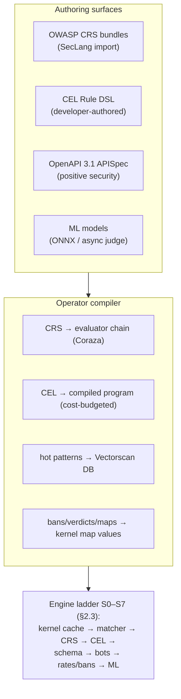

*Figure 9. One bundle; the ladder short-circuits on the first decisive verdict.*

### 11.2 CRS: the correctness baseline

- CRS 4.x imported as first-class `RuleSet.source` (bundle + paranoia level + per-rule exclusions);[139][141][178] SecLang parsed by the embedded Coraza-compatible evaluator[134][133] — CRS parity is a CI gate (§11.8), not an aspiration.
- **Why borrow CRS:** community-maintained coverage for OWASP Top-10 classes, PL1–PL4 tuning vocabulary, the exclusion ecosystem;[142][171][132] reinventing this corpus means years of FP tuning.[322]
- **Why CRS alone is not enough:** regex-chain cost at scale, no positive-security model, no bot/rate/ban semantics, no AI-class detection.[161][162][159] CRS gives coverage; Trishula adds speed (§11.4) and altitude (§2.3).

### 11.3 CEL as the developer-facing DSL

CEL chosen over new-DSLs/rego/proxy-wasm because: small, well-specified expression language;[137] Envoy/K8s familiarity (CEL authz, admission control);[157][146] compiles to fast AST evaluation; cost-budgeted. It addresses a structured request view:

```
request.method, request.path, request.headers (map),
request.body.{text, json, form, bytes}, request.uri_queries,
request.client.{ip, asn, geo, reputation, ban_state},
request.ja4, request.rate_windows,
response.{status, headers, body-chunks},
tx.{score, matched_rules, flags: {smuggling_suspect, oversized_body, ...}}
```

Example developer rules:

```
// rate-shape rule (feeds the §13 ladder as a scoring input)
request.method == "POST" && path.matches("/v1/chat/*") &&
request.rate_windows["5m"].requests > 40

// body-level rule with the structured view
request.method == "POST" &&
path.matches("/v1/chat/*") &&
request.body.?json.messages.size() > 128 &&
request.client.reputation < 0.3
```

Ladder position: after CRS short-circuit, before schema gating, for observability parity; per-rule `action/phase/tags/severity` mirror SecLang semantics for imported-rule parity.

### 11.4 The compiled fast path: Vectorscan matcher

The hot subset of CRS + CEL patterns compiles to a Vectorscan DB (open-source Hyperscan-family; x86/ARM/POWER;[173][128] Suricata-backed[172]). Single scan across the pattern set, block/streaming mode over reassembled bodies.[136][129] **Differential gate:** matcher verdicts shadow-evaluated against the reference evaluator on 100% of traffic; divergence demotes the pattern to reference-path-only (self-healing parity; §11.8). Memory budget validated in §17.2 (R2b).

### 11.5 Positive security (schema) and API discovery

- `APISpec` CR wraps an OpenAPI 3.1 doc per (host, route-prefix): paths/methods/params/content-types/field types/lengths/required/patterns → compiled validators.
- **Enforce mode:** unmatched path/method → block; param type/length/pattern violations → block with per-field telemetry. This is the tier-1 commercial feature the OSS field rarely ships (§4).
- **Learn mode:** discovery builds the spec from live traffic (endpoint extraction, JSON-schema inference with cardinality tracking), emits CR diffs; drift telemetry on live-vs-reviewed divergence.
- Response-side schema (exfiltration guard): Phase 2 of the roadmap (§20.2).

### 11.6 Bot detection & anti-automation (detail in §12)

The ladder's S5 family: JA4/JA4S fingerprints at the termination hop; header order/entropy; per-source behavioral windows from the shield; per-detector verdicts merge into the request score *and* the ban score.

### 11.7 Rule lifecycle (shadow-first)

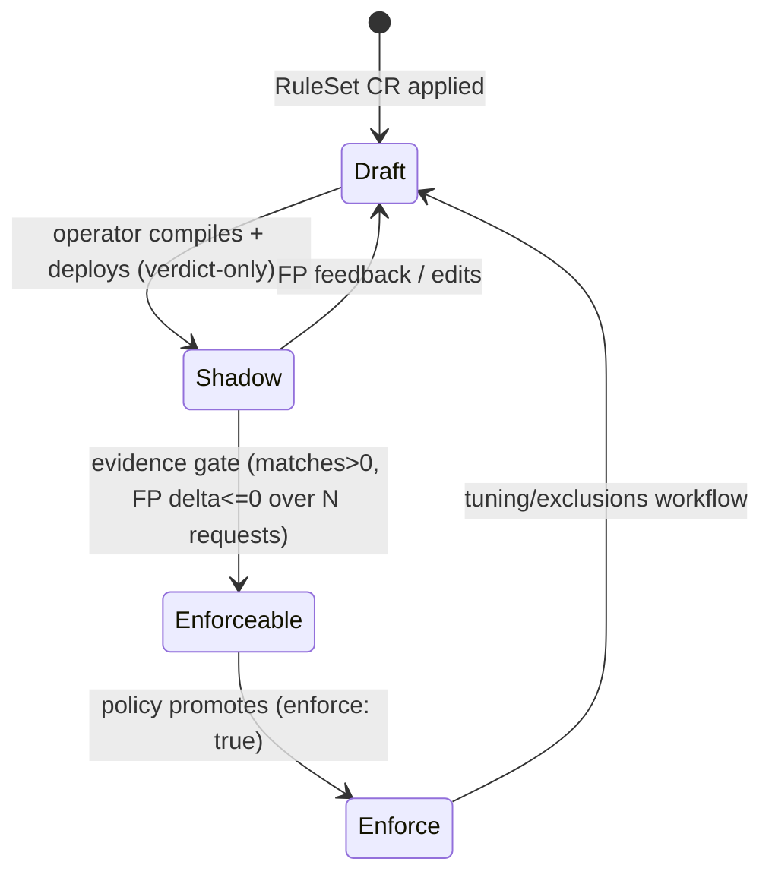

*Figure 10. Shadow-first lifecycle; promotion requires evidence, never a dry `apply`.*

`kubectl apply` → operator compile → signed bundle distribute → per-replica atomic swap (double-buffered matcher DB + evaluator chain) → CR status Conditions. Time-to-enforce target ≤ 5 s (§17 gate).

### 11.8 CRS differential parity gate

The product's honesty mechanism, enforced twice:

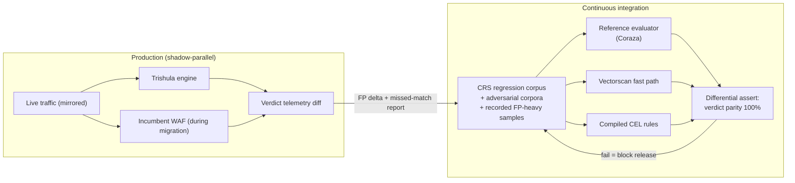

*Figure 11. Release-blocking in CI; evidence-generating in production.*

Rules of the gate: parity is **verdict-level** (block/log/pass + matched-rule IDs + score ladder); corpus = upstream CRS regression tests + curated adversarial corpora + recorded production samples;[177][165] a fast-path pattern the reference evaluator disagrees on is **demoted automatically**; exclusions are versioned and shadow-tested like any rule change.

<div class="pagebreak"></div>

## 12. Bot Defense & Anti-Automation

Bots are the workload most HTTP security products still treat as a signature problem. Trishula treats bot detection as **evidence accumulation**: three independent detector families contribute to one per-source bot score, which feeds both inline decisions and the ban engine (§13).

### 12.1 Detector families

| Family | Signal | Mechanism | Cost kernel/userspace |
|--------|--------|-----------|----------------------|
| **TLS fingerprinting** | JA4/JA4S of the client handshake[197][F-ja4] | computed at the termination hop (gateway) and passed as metadata, or engine-computed when the engine terminates; matched against known-tooling DB | userspace, µs-class |
| **Header-plane fingerprints** | header order, casing, value entropy, HTTP-version quirks | ordered-hash comparison against browser/tooling profiles; detects curl/python/bot-framework masquerades | userspace, µs-class |
| **Behavioral** | request pacing, path-traversal graphs, session continuity, auth-failure ratios, endpoint-uniqueness | per-source sliding windows (§13.2 counters) + session-scoped aggregates | kernel counters → userspace scoring |

Each detector emits `(detector_id, confidence, evidence_ref)` — never a bare boolean. The merge rule is configurable per `WAFPolicy`: consensus (≥2 families agree) triggers action; single-detector matches log and score.

### 12.2 Verdict integration

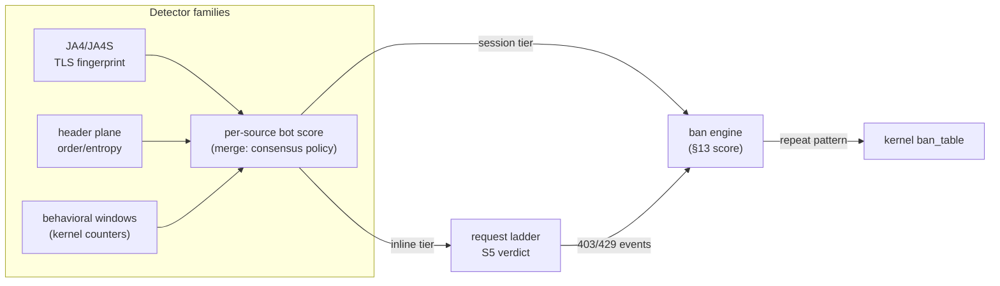

*Figure 12. Bot evidence flows two ways: inline per-request, and into the temporal score that causes bans.*

- **Known-good bots** (documented crawlers, health checkers from the gateway, monitoring agents) are an allowlist CR (`BotPolicy.knownGood`) with reverse-DNS validation on the termination-hop identity — misclassified-good bots are a tuning case, not a detection failure.
- **Challenges:** v1 ships `challenge` as a verdict action (evidence-of-work via signed redirect token; no third-party CAPTCHA in the default path — a pluggable interface exists for estates that run one).
- **Credential-stuffing posture:** auth-endpoint failure ratios + JA4 heterogeneity + velocity → high ban scores; paired with per-identity (not just per-IP) rate keys when JWT identity is present (§13.2).

### 12.3 Honest limits

- TLS fingerprints are forgeable by a sufficiently motivated attacker (JA4 is a *cost raiser*, not identity);[F-ja4] header fingerprints similar. The design assumes adversaries adapt; behavioral windows (§13) are the harder-to-forge altitude because they are kernel-observed, not client-controlled.
- Fingerprint DBs decay (library versions change); the known-tooling matching set ships as a digest-pinned feed CR on the §16.6 upgrade cadence, not hardcoded.

<div class="pagebreak"></div>

## 13. Rate Limiting, DoS Response & Temporary Bans

**This section is the product's named differentiator:** a fail2ban-for-HTTP algorithm — the temporal-ban UX that made fail2ban ubiquitous[147], re-specified for HTTP, computed on the wire, enforced in the kernel, and observable as first-class OTel events. Rate limiting *limits*; bans *remove*. Trishula ships both as one scored pipeline.

### 13.1 Why temporary bans, and why kernel enforcement

A rate limit answers "too fast, slow down"; a temporary ban answers "you are an actor, leave for N minutes." Every operator who has run fail2ban knows the operational value: thresholds and windows are legible, bans are temporary and auditable, and repeat abuse escalates without permanent blocklist maintenance. But fail2ban parses logs — a wire-level problem answered at tap altitude, with filesystem state and no per-route policy.[147] Trishula's version: the engine (which sees full HTTP) computes scores; the shield (which owns the NIC) enforces at line rate; state is a kernel map + a userspace ledger; every step is a CRD knob and an OTel event.

### 13.2 The rate algorithms (per-route, CRD-selected)

| Algorithm | Best for | Semantics | Notes |
|-----------|----------|-----------|-------|
| **Token bucket** | steady-state per-route budgets | refill rate r, burst b; reject when empty | the default for API quotas; matches NGINX/Envoy semantics[149][F-ngxrl] |
| **Sliding window** | burst-sensitive endpoints | exact windowed count over k samples; no boundary spike | anti-brute-force on auth endpoints |
| **EWMA rate** | behavioral DoS signals | exponentially weighted arrival rate per source | kernel-side `rate_windows` already produce these (§9.5); cheap and smooth |
| **Score ladder** | the ban decision itself | weighted event scores in a sliding findtime window | §13.3 — the fail2ban translation |

Rate keys are CRD-composable: source IP (default), IP+route-class, JWT `sub`/`client_id` when identity exists, or JA4 cluster. Keys compose (a route may limit per-IP *and* per-identity simultaneously).

### 13.3 The ban algorithm: `ScoredWindowBan v1` (specified)

Named, versioned, and pinned by this document — implementations must reproduce it from this spec alone (a conformance test does exactly that).

```
State per source key s:
  events[s]  : sliding window of (timestamp, weight)   # decayed evidence
  state[s]   : ACTIVE_BAN(until, tier, reason_codes) | CLEAR
  recidivism[s] : count of prior bans (for backoff)

Constants (BanPolicy CR defaults ⇢ fail2ban analog):
  findtime      W   = 10m        ⇢ findtime   (evidence window)
  threshold     T   = 10         ⇢ maxretry   (score, not raw count)
  bantime       B   = 10m        ⇢ bantime    (base duration)
  backoff       κ   = 2          ⇢ recidive jail (exponential repeat multiplier)
  max_bantime   Bmax = 24h       (human-scale cap; permanence is a decision, not an accident)

Scoring (weights from BanPolicy, defaults):
  CRS critical match            +5     CRS warning match        +2
  bot consensus verdict         +4     single-detector bot hit  +1
  rate-window breach            +3     schema violation         +2
  auth failure (401/403)        +2     kernel EWMA burst flag   +3
  score decay: exponential, half-life 20% of W (staleness by design)

Decision loop (engine, per request + periodic sweeper):
  1. score[s] = Σ w_i · exp(−λ·(t_now − t_i))  over events in W      # λ from half-life
  2. if state ACTIVE_BAN and t_now < until: enforcement continues (§13.4); no re-scoring
  3. if score[s] ≥ T: ban → state = ACTIVE_BAN(
         until  = t_now + min(B · κ^recidivism[s], Bmax),
         tier   = scored-window, reason_codes = weight contributors)
     recidivism[s] += 1; emit ban event (§13.5)
  4. unban: automatic at until; evidenced early-release only via §13.6 workflow

Prefix escalation (opt-in, default off — collateral risk gate):
  if ≥ N distinct keys in one /24 (IPv4) or /48 (IPv6) banned within W:
    issue prefix ban at /24 or /48 with a stricter tier + shorter bantime
    (the bansubnet idea[147], gated behind a threshold that makes accidents rare)
```

- **Shadow-first:** `BanPolicy.mode: shadow` computes and emits ban verdicts (metrics + logs) *without* enforcement; promotion requires the same evidence gate as rules (§11.7). This is how a new route earns its thresholds — no folklore tuning.
- **Kernel enforcement:** the engine writes ACTIVE_BAN keys into the `ban_table` map (§9.3) with expiry; XDP/TC drop (or tarpit) without consulting userspace. Ban writes are the always-sampled high-priority ring class (§9.4).
- **What the kernel never does:** compute scores. The kernel is decision-free (verifier-bounded, audit-simple); it applies verdicts it is given (§9.5).

### 13.4 Enforcement actions by tier

| Tier | Trigger | Action | Client sees |
|------|---------|--------|-------------|
| L0 observe | first breaches | log + score only | normal response |
| L1 rate | rate-window breach | throttle | `429` + `Retry-After`[F-rfc9110] |
| L2 ban | score ≥ T | temporary drop at kernel + `429` mirror at app layer | connection drop / `429` + `Retry-After` |
| L3 tarpit | flood-class (kernel EWMA) | kernel tarpit/drop at XDP | connection timeout |
| L4 prefix | §13.3 escalation | prefix-level XDP drop | drop |

`Retry-After` is always present on any 429 Trishula emits — a deliberate developer-experience signature (DX5): a rate-limited client learns exactly when to retry, from the component that rate-limited it.

### 13.5 Observability of bans (first-class)

- `trishula_ban_active{tier,key_class}` gauge; `trishula_ban_total{tier,reason,action}` counter; `trishula_ban_score` histogram per key class.
- Every ban decision emits an **OTLP log record** (§15) with: key, score trajectory (the contributing events with weights), trigger rule refs, until, tier — the analyst reads *why* without replaying anything.
- Ban table state is exportable (`trishulactl ban list --output json`) — CRD-adjacent debuggability, no console.

### 13.6 Unban and override

- Automatic expiry (map TTL + ledger sweep).
- Analyst release: `trishulactl ban release --key <k> --reason <txt>` — audited, emits an OTel event referencing the operator identity (K8s RBAC governs who may release).
- Developer release (the DX1-flavored path): a `BanRelease` CR an app team can apply for their own route class during a false-positive incident, namespaced-RBAC-scoped; the release event links to the ban event's evidence in the audit log.
- Unban evidence (post-release behavior) is tracked: a released key re-banned within B enters recidivism with κ raised — the algorithm distinguishes "oops, CI ran from a datacenter IP" from "retrying botnet node."

### 13.7 DoS response posture (who does what)

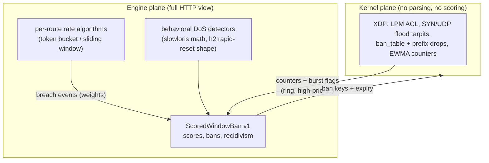

*Figure 13. Division of labor: kernel counts and drops; the engine scores and decides; bans feed back kernel-ward.*

- **L3/L4 floods:** shield XDP tarpits/drops (§9.2), independent of any policy — this layer is fail-open-by-default (a shield bug must never take the path down; R7 discipline).
- **Slowloris / connection starvation:** kernel `flow_stats` (§9.3) feed the engine's behavioral detector; response is L2/L3 bans — a per-request WAF *cannot* win this fight; a flow-keyed kernel counter can.
- **h2 rapid-reset shape:** stream-reset ratios per connection in the engine parser; flagged as `tx.flags.rapid_reset_suspect`, scored, and (confirmed) banned.
- **Application-layer request floods:** §13.2 algorithms + ban ladder.
- **Oversized/malformed:** parser admission caps (§17.2 R-DoS) — 413/400 fast, no resource asymmetry.
- **What Trishula does not do:** BGP-grade volumetric defense is the upstream network's job; Trishula makes the *first node in the cluster* unprofitable, not the last hop on the internet.

<div class="pagebreak"></div>

## 14. ML & Adaptive Detection

### 14.1 Scenario catalog

| # | Scenario | Signals | Model class | Band | Phase |
|---|----------|---------|-------------|------|-------|
| S1 | Known-attack classifier | decoded-payload features, CRS match context | supervised tree/linear (XGBoost-class) | inline, µs | P1 |
| S2 | Zero-day anomaly | request/session feature vector (lengths, entropy, char-class, param counts, rate shapes) | Isolation Forest / LOF | inline, sub-ms | P1 |
| S3 | Bot / ATO / stuffing | JA4 + header fingerprints, behavioral windows, auth ratios, endpoint-uniqueness | per-detector voting ensemble, session-level | session-window | P1+ |
| S4 | Prompt-injection / jailbreak semantics | token sequences, instruction patterns | small classifier cascade first; LLM judge async | cascade + async | P1+ |
| S5 | Exfiltration on responses | response-entity volumes vs schema, entropy spikes, PII patterns | rules + S1/S2 on response view | response path | P2 |
| S6 | API behavioral drift | per-endpoint verdict/feature distributions | drift monitors (PSI-class) on verdict streams | offline + canary | P1 |

### 14.2 The hand-off contract: ML never reads packets

The binding design rule: **ML reads structured feature views derived from engine + eBPF events** — never raw wire data.

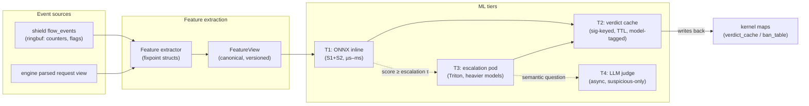

*Figure 14. Feature views are versioned artifacts; verdicts backfill kernel caches — including ban tables, closing the loop with §13.*

1. **FeatureView v1 (stable, version-tagged):** per-request vector — method/path-class one-hots, body-size buckets, entropy/char-class stats, param counts/type hashes, decoded-layer indicators, `src_rep` fields, fingerprint fields (JA4 hash, header-order simhash), session-window aggregates, rate-window values. eBPF contributes cheap counters (§9.5); the parser contributes payload features. Precedent: hybrid eBPF/ML IDS with kernel-extracted flow features via ringbuf, userspace ensemble, verdicts written back to kernel maps — end-to-end median 1.4 ms on one core.[222]
2. **Inline tier (T1) budget:** ONNX Runtime CPU; tree/linear models on tabular features are µs-class.[215][216] BERT-class transformers are out of the inline budget (BERT-base CPU p50 ≈ 42 ms)[228] — cascade instead: cheap-first → escalate (literature: near-transformer accuracy at ~0.1 ms effective average[216]).
3. **Escalation tier (T3):** Triton pod[242][244], only suspicious-band traffic, synchronous only when the route budget allows, else async with verdict-cache backfill; GPU sharing via MIG slices for SLO isolation where GPUs exist.[224][225]
4. **LLM judge (T4):** always async, suspicious-only, verdicts cached (TTL 24 h default); judge model+prompt pinned as supply-chain artifacts; heterogeneous judges for robustness — the judge is itself an attack surface (surrogate-transfer and poisoning results[217][218][219]), so oracle access is rate-limited (§13) and verdicts are never LLM-only.
5. **Verdict cache (T2):** userspace LRU keyed on normalized request signature, TTL + model-version tag; high-confidence block verdicts **and ban scores** written back to kernel maps → repeat enforcement at line rate (§13.3 loop closure).
6. **Learning lifecycle (per asset):** `learn` → `shadow` → `enforce-high-confidence` → `enforce-full`; promotion gates: sample volume, convergence, shadow FP ≤ budget (precedent: open-appsec's lifecycle[239][201], minus its central-plane coupling; SafeLine's audit/balance/strict modes[202] inform the knob surface).
7. **Drift as security telemetry:** prediction-drift monitoring on per-endpoint verdict rates doubles as an **evasion canary** (a rise in suspicious-but-allowed is often probing); PSI-class alerting with rolling reference windows; retraining gates off confirmed drift, not raw alerts.[243]

### 14.3 Evasion posture (documented, evidenced)

- Threat model: mutation-based evasion, surrogate-model adversarial optimization, judge manipulation.[230][234][218][219]
- Mitigations: probe rate-limits + shadow-first (limits oracle budget on expensive stages); perturbability-scored feature selection (favor hard-to-perturb flow/behavioral stats over user-controlled strings); heterogeneous ensembles; verdict-cache TTLs bounding probe reuse; explanation attached to every ML verdict for the analyst loop.
- Honest limit: no ML WAF is evasion-proof; the goal is raising attacker cost to impractical, not purity.[211]

<div class="pagebreak"></div>

## 15. OpenTelemetry Observability

**OTel is the product's narration, not an afterthought:** traces, metrics, **and OTLP logs as first-class signals**, all correlated, all exportable to whatever backend the team already runs. The WAF verdict is a trace event on the request's span — the developer who owns the API finds security answers in the same place they find latency answers (D4 thesis, mechanized).

### 15.1 The three signals, as contracts

| Signal | What Trishula emits | Key correlation |
|--------|--------------------|-----------------|
| **Traces** | one server span per request at the engine (stages: parse → ladder S0–S7 → verdict → forward); shield events attach as span links/attributes; upstream forwarded with propagation headers preserved | `trace_id` = the request's identity end-to-end (gateway sets it; engine never strips) |
| **Metrics** | per-rule match counters, per-phase latency histograms, ring depth/drops, cache hit rates, ban gauges/counters (§13.5), ML tier latencies + verdict distributions, schema-drift counters, exclusion hit counts | exemplars carry `trace_id` → jump from dashboard to trace |
| **Logs (OTLP)** | structured verdict log records: verdict, rule IDs, plain-language reason (DX5), score ladder snapshot, ban evidence blocks (§13.5), body samples only under `debugBodies` CRD flag with redaction always on | every record carries `trace_id` + `rule_id`; the ban record carries the full score trajectory |

### 15.2 The verdict record (log-body schema, versioned)

```json
{
  "schema": "trishula.verdict.v1",
  "trace_id": "…", "span_id": "…",
  "route": {"host": "api.example.com", "path": "/v1/chat", "policy": "chat-completions"},
  "client": {"ip": "…", "ja4": "…", "asn": 0, "reputation": 0.42, "rate_windows": {"5m": 41}},
  "ladder": [
    {"stage": "matcher", "matched": ["920480"], "us": 12},
    {"stage": "crs", "matched": ["942100"], "score_delta": 5, "us": 210},
    {"stage": "bot", "detectors": {"header_order": 0.8}, "consensus": false},
    {"stage": "rate", "windows": {"5m": {"requests": 41, "limit": 30}}, "breach": true}
  ],
  "verdict": {"action": "ban", "tier": "scored-window",
              "reason": "rate breach + CRS critical within findtime",
              "until": "2026-10-01T12:40:00Z", "ban_recidivism": 0,
              "doc_ref": "docs/academy/module4-rates.md#scoredwindowban"},
  "evidence": {"body_sample": null, "note": "debugBodies disabled"}
}
```

`doc_ref` is the teach-the-web hook (§7.2): every machine verdict points at the human explanation of the mechanism that fired it.

### 15.3 Kernel-plane counters (shield)

XDP drop/pass/tarpit per map and reason class; ring depth + drops; per-prefix rate EWMAs; ban-table occupancy/expiries. Exported on a fixed tick by the shield, OTel-native; xdpcap-compatible capture hook ships from day one (XDP-dropped packets are invisible to tcpdump — forensics needs a sanctioned capture path)[66].

### 15.4 Dashboards & redaction

- Grafana pack ships in-repo per route class: verdict mix, altitude hit-rates (kernel/matcher/evaluator/ML), FP-rate deltas, ring health, ban ledger trends, ML latencies.
- **Redaction is structural:** header values containing `authorization`/`cookie`/token-shaped strings are dropped at emission; body bytes never leave the pod unless `debugBodies: true` is set per policy *and* a purpose annotation is present; OTel exporters get the same treatment as logs (§18.3).
- Every record's schema is versioned (`trishula.verdict.v1`) — backends pin and migrate explicitly, never scrape-guess.

<div class="pagebreak"></div>

## 16. Kubernetes Deployment Model & Operations

### 16.1 Workloads

| Deployable | Kind | Nodes | Privileges | Notes |
|------------|------|-------|------------|-------|
| `trishula-shield` | DaemonSet (hostNetwork) | every traffic-fronting node | privileged (BPF, netlink, BPFFS mount) | loads XDP+TC via cilium/ebpf; pins maps on host BPFFS |
| `trishula-engine` | Deployment + Service (cluster-internal) | engine nodes (label-selected, shield-co-located) | none beyond NET_BIND_SERVICE | the steered WAF backend; HPA on p99-latency + ring-depth |
| `trishula-operator` | Deployment | control-plane-ish | CRD watch, bundle distribution | compiler + rollout + status |
| escalation inference (T3) | Deployment (Triton) | GPU/MIG pool or CPU | — | only S3/S4 escalation tiers |
| telemetry | OTel Collector (existing estate) | — | — | Trishula exports OTLP traces/metrics/**logs**; no new stack |

### 16.2 CRD set (v1alpha1)

- **`WAFPolicy`** (namespaced): binds rule bundles + modes + failure semantics to route classes (HTTPRoute annotation or `routeSelectors`).
- **`APISpec`** (namespaced): OpenAPI 3.1 positive-security doc + learn/enforce/report mode.
- **`RuleSet`** (namespaced): CRS bundle refs (version, paranoia, exclusions), CEL custom rules, compiled-pattern subsets.
- **`BanPolicy`** (namespaced): §13 constants (findtime/threshold/bantime/k/max_bantime), weight table, rate-algorithm selection per route class, mode (shadow/enforce), prefix-escalation gate.
- **`MLModel`** (namespaced): digest-pinned model refs, tier, mode, thresholds.
- Status model mirrors Gateway API conventions: `Accepted` / `Programmed` / `ResolvedRefs` Conditions per CR.

### 16.3 Scheduling and resource shapes

- **Shield:** one pinned core per NIC RX queue in flood-heavy deployments (XDP drop ≈10.1 Mpps/core measured by Cloudflare; 24 Mpps/core, 41.6 ns/packet in the FAST'18 paper; AF_XDP zero-copy 21.5 Mpps on i40e)[60][75][72]; CPU-manager static policy; hugepages not required; memory ≈ 256Mi base + 16Mi ring.
- **Engine:** 4 vCPU / 4Gi baseline replica (§17 targets); HPA signal = p99 inspect-latency + ring depth; topology-spread required; nodeAffinity on `trishula.shield/ready=true` + BPFFS hostPath for pinned-map access (§9.3).
- **Multitenancy:** per-namespace CRDs; per-tenant compiled bundles; route-class-partitioned replicas when tenants demand isolation (R8).

### 16.4 Lifecycle of Trishula in a cluster

| Stage | What happens | Owner |
|-------|--------------|-------|
| **Day-0 install** | Helm/manifests: operator first (CRDs valid), shield DaemonSet second (maps pinned, node labels `trishula.shield/ready=true`), engine Deployment third. Preflight: kernel ≥5.8 + BTF on shield nodes, BPFFS mount, native-XDP NIC modes. Lab first: the kind/NGF walkthrough (§10.3) is the documented install proof | platform |
| **Day-1 attach** | `WAFPolicy`/`APISpec`/`BanPolicy` CRs applied; routes bound; shadow baseline; CRS differential first-run | security + platform |
| **Day-2 steady state** | policy changes via CRD (shadow-first), feed refreshes on cadence (§16.6), HPA handles load, on-call follows §16.7 | on-call |
| **Drain/pause** | per-route `bypass: true` in WAFPolicy (engine forwards without inspection) or weight-shift at the gateway — maintenance without topology change | on-call |
| **Uninstall** | detach routes → engine down → shield down (per-hook detach) → operator deletes BPFFS subtree `/sys/fs/bpf/trishula/` → CRDs removed last. Zero kernel residue: `bpftool`-verified cleanliness job (DX6) | platform |

### 16.5 Versioning, upgrades, rollback

- **Independent semver trains:** operator / shield / engine / bundles; skew N and N−1; bundles forward-compatible one engine minor, else `BundleIncompatible` Condition.
- **Kernel compatibility is a shield-release property:** CI-verified kernel range declared per release; out-of-range → generic-XDP/TC degraded mode + loud Condition.
- **Upgrade order:** operator (first, no-ops on old CRs) → shield rolling (atomic per-hook swap; verifier failure keeps old shield enforcing, node marked degraded) → engine bundle double-buffer (drain→swap→rejoin — ordinary backend churn from the gateway's view; the reference topology makes NGF's endpoint tracking the canary infrastructure free of charge).
- **Rollback = re-pin of the previous bundle hash (CRD-recorded), never hand-hacked.**
- **CRD evolution:** conversion webhooks; two-minor deprecation windows; CRD diff in release notes.
- **CRS baseline:** engine pins CRS 4.25.x LTS baseline; `RuleSet` CRs override; baseline bumps travel the same shadow gate as any rule change.

### 16.6 Signature and intel feed upgrades

- **Feeds are CRs, not pipeline magic:** `RuleSet` (CRS + CEL), `ThreatIntel` (IP reputation/JA4 lists feeding `src_rep`), bot-fingerprint DBs (§12.3), `MLModel` artifacts — all digest-pinned; the operator resolves → compiles → stages via the same shadow ladder.
- **Cadence:** CRS upstream LTS quarterly point-releases → auto-PR into the fleet's RuleSet repo (the PR *is* the review); CEL customs — human PR-gated; intel feeds — daily/weekly digest bumps without shadow gate (additive map entries, reversible by map replace).
- **Emergency out-of-band:** critical CVE drop uses the same CR path with the evidence gate bypassed by explicit `emergency: true` — audited, 72 h time-box, auto-revert absent analyst sign-off; `PolicyEmergencyActive` alert fires.
- **FP hygiene:** verdict telemetry → exclusion workflow → exclusion CRs shadow-tested too.

### 16.7 Day-2 runbook

**SLOs (product-owned):** inspection p99 ≤ 1.5 ms (the §17 gate, exported continuously); differential parity = 100%; availability = engine endpoints healthy per route (99.9% inline-enforced).

| Alert | Meaning | First response |
|-------|---------|----------------|
| `EngineInspectP99High` | p99 over budget 5 min | HPA events → ring depth → body-size mix → scale or shadow-bypass heavy route |
| `RingDepthHigh` / `RingDropped` | shield ring near-full | enrichment degradation, not verdict loss (§9.4): check co-location, scale node engines, hunt event storms |
| `BundleFleetDrift` | replicas with differing bundle hashes | pin rolling state; stuck replica → drain, force swap, verify parity counters resume |
| `FpRateAboveBudget` | shadow FP over budget | freeze promotion gates; open tuning-queue item |
| `BanRateAboveBudget` | ban rate anomalous (§13.5) | likely legate FP or an attack: inspect ban OTel evidence blocks before touching thresholds |
| `MlVerdictLatencyHigh` | ONNX tier over 1 ms | auto-degrade to async (built-in); investigate drift; MLModel → `mode: shadow` |
| `DriftCanary` | verdict-distribution shift (§14.2) | likely probing/schema drift → top changed endpoints → analyst review |
| `ShieldNodeDegraded` | verifier/load failure on a node | node's old shield keeps enforcing; schedule fix; never mass-restart shields |
| `PolicyEmergencyActive` | emergency-gate bypass active | analyst sign-off or 72 h auto-revert |

**Capacity:** engines scale with request rate × body depth; shield is NIC-class. `trishulactl capacity-plan --traffic-profile` dry-run ships.

**Backup/DR:** policies/rules/specs live in etcd + GitOps; reapply = rebuild; engines/shields stateless beyond pinned maps; cluster-loss recovery = GitOps redeploy in §16.4 order; CI ships a "rebuild-from-CRs" test proving last-enforced state is reachable from CRs alone.

<div class="pagebreak"></div>

## 17. Performance Targets & Benchmark Plan

### 17.1 Budgets by stage

| Stage | Budget (p99, per request) | Enforced by |
|-------|--------------------------|-------------|
| XDP shield (ACL/flood/cache/ban-hit path) | ≤ 10 µs | shield DaemonSet, node NIC |
| TC classifier + ringbuf emit | ≤ 20 µs | shield DaemonSet |
| Engine parse + deep inspect (CRS+CEL+schema, 8KB body) | ≤ 600 µs | engine |
| Engine parse + deep inspect (64KB JSON body) | ≤ 1.2 ms | engine |
| ML local scorer (in-band, parallel with rules) | ≤ 1 ms | engine ML tier |
| Total inline hop added vs direct (8KB, full CRS) | ≤ 1.5 ms p99 / ≤ 300 µs p50 | end-to-end gate |
| Kernel-cached verdict/ban short-circuit | ≈ 1 µs kernel-side; ≤ 100 µs with context fetch | shield |
| Throughput per engine replica (4 vCPU, CRS+schema) | ≥ 10k req/s | load gate |

Kernel-side numbers are literature-shielded envelopes (Cloudflare's 10 Mpps/core drop, FAST'18's 24 Mpps/core, AF_XDP 21.5 Mpps[60][75][72]) — not vendor claims. Userspace budgets are **PRD targets pending PoC validation**, gated by the benchmark plan; §6.4 labels them targets until measured.

### 17.2 Benchmark plan

Harness: `bench/` in-repo; wrk2 (closed-loop) for latency distributions; h2load for HTTP/2; vegeta for burst shapes; flood scripts for shield Mpps.

1. **Baseline** — direct-to-pool via NGF (no WAF): p50/p99, throughput, churn.
2. **Inline idle** — Trishula in path, mostly-passing traffic: isolates proxy+parse cost.
3. **Inline steady state** — CRS PL2 + schema enforce + CEL set at realistic mix.
4. **Short-circuit economics** — verdicts resolved per altitude (kernel cache/matcher/evaluator/ML) and cumulative cost curve; validates the two-plane principle.
5. **Ban-ladder effects** — ScoredWindowBan under mixed traffic: score computation cost, ban-hit path at XDP (target: indistinguishable from plain cache hit), unban churn.
6. **Shield flood** — SYN/UDP floods at a test NIC: drop Mpps/core and legit-traffic preservation ratio.
7. **Body-size ladder** — 1KB→1MB through CRS PL2: throughput knee, reassembly windows, 413 thresholds, smuggling corpus.
8. **ML ladder** — ONNX scorer batch/latency curve; degrade-to-async under backpressure (never queue the request).
9. **Hot reload** — RuleSet apply → time-to-active per replica; verdict integrity across reload.

CI gates: p99 regression > 10% fails CI; CRS differential suite (§11.8) runs on every bpf/engine commit; flood scenarios nightly on bare-metal runners.

<div class="pagebreak"></div>

## 18. Threat Model of Trishula Itself

Security infrastructure whose own compromise is an escalation path; STRIDE-flavored, focused on what is specific to this design.

### 18.1 Assets and trust boundaries

- **Assets:** rule bundles, kernel map contents (verdict/ban/reputation caches), ring-buffer stream, ML models (FeatureView, weights, judge prompts), CRD state, body samples in debug logs, **ban ledger evidence**.
- **Boundaries:** kernel↔userspace (ringbuf, pinned maps — any pod with BPFFS hostPath), network front (gateway→engine hop), upstream (engine→pools), control plane (CRD apply → operator → bundles), ML supply chain.

### 18.2 Threats and treatments

| Threat | Vector | Treatment |
|--------|--------|-----------|
| **Parser-differential bypass** | smuggling-shaped requests the Trishula parser normalizes differently than upstream pools (TE/CL conflicts, obs-fold, Unicode/base64 layers)[162] | strict RFC 9112 normalization, reject-on-ambiguity; smuggling flags as `tx.flags`; differential corpus includes smuggling shapes (§11.8) |
| **Shield blind spot as bypass** | abuse timed to shield reload windows or non-shielded nodes | atomic per-hook program replace; shield-ready gating of node labels; shield-down is a Condition + metric |
| **BPFFS mount abuse** | privileged pod reads/writes pinned maps (verdict-cache or **ban-table** poisoning) | pin only under trishula-owned dir, map write perms restricted to shield UID; map writes treated as operator-plane API with audit; alert on foreign map writers |
| **Ban-table weaponization** | attacker farms evidence against a victim key (shared NAT/CGNAT egress) to ban legitimate users | prefix-escalation off by default (§13.3); per-identity keys where JWT exists; `BanRelease` CR (§13.6) gives named victims a namespaced-RBAC unban path; ban evidence records name contributing rule refs |
| **Ring flood / enrichment forgery** | malicious local workload farms ring events to starve engines or inject fake flow metadata | bounded structs (no free text beyond bounded fields); engine-side consumer budgets per source; flow metadata advisory — decisive verdicts come from payload the engine parsed itself |
| **CRD/registry supply chain** | malicious RuleSet CR (ReDoS), poisoned ML model, tampered CRS bundle | CRD RBAC + admission policy per namespace; bundles digest-pinned + operator-signed; MLModel refs digest-pinned; CRS bundles from pinned upstream tags with recorded hashes |
| **Judge/model poisoning & oracle abuse** | adversary probes ML tiers to craft evasions or poison learning | probe rate-limits (§13), shadow-only learning inputs gated by analyst promotion, canonicalized judge inputs, heterogeneous judges, verdict-cache TTLs bound oracle reuse |
| **DoS against Trishula itself** | regex-catastrophic bodies, huge decodes, h2 rapid-reset, schema-bomb JSON depths | parser resource budgets per request (input/depth/decode caps), Vectorscan has no catastrophic backtracking, h2 settings caps, admission body-size ladder |
| **Debug-body samples as data leak** | `debugBodies: true` writes payloads to logs | redaction pipeline (header/token always; body only under CRD flag + purpose binding), per-tenant sample budget, retention config |
| **Fail-open regression** | misconfig silently flips a protected route to bypass | schema requires explicit `failureMode`; preflight admission denies `failClose` routes resolving to engines with no healthy replicas; drift alert when enforce-mode route lacks engine coverage |

### 18.3 Abuse of Trishula as vantage

- The engine is a trusted proxy: it sees tenant payloads. Network policy confines engine egress to pool CIDRs + telemetry collector; no direct egress beyond declared upstreams.
- OTel payloads (verdict metadata, ban evidence) are sensitive: redaction applies to telemetry exporters as to logs (§15.4).
- The ban ledger is an *attack record*: access to it should be treated like access to audit logs — RBAC-scoped read paths (`trishulactl ban list` requires cluster-reader-class RBAC).

### 18.4 What is explicitly trusted

The gateway's TLS termination and steering marks; the kernel BPF verifier; the node kernel; OCI registry integrity; CRD RBAC below the operator. Trusting these is what makes Trishula small; residual risks above are documented, not hidden.

<div class="pagebreak"></div>

## 19. Reference Implementation

**Repo footprint (D6 in §2.6):** GitHub org **`trishula-dev`** (github.com/trishula-dev) — repos: `trishula` (product, Apache-2.0; the tree below is its seed), `website` (trishula.dev, the docs site), `rules` (curated community CEL + exclusion sets once external contributions open, Phase 1+). The bare handle `trishula` is a dormant user account; the product repo is `trishula-dev/trishula`.

Minimal-but-honest starting points; the PoC proves the ladder end-to-end (build notes in §20). Repo layout:

```
trishula-dev/trishula/           # product repo (Apache-2.0) — §19/TR-01 seed
├── api/v1alpha1/                # CRD types (controller-gen from Go structs)
│   ├── wafpolicy_types.go
│   ├── apispec_types.go
│   ├── ruleset_types.go
│   └── banpolicy_types.go       # §13 constants + weights + mode
├── cmd/
│   ├── shield/                  # DaemonSet loader (cilium/ebpf)
│   ├── engine/                  # userspace WAF server (proxy + ext_proc transports)
│   ├── operator/                # CRD controller + compiler
│   └── trishulactl/             # ban list/release, capacity-plan, policy lint
├── bpf/                         # C sources, CO-RE (vmlinux.h, bpftool gen)
│   ├── shield_xdp.c             # XDP ACL/floods/ban-table/verdict-cache
│   ├── flow_tc.c                # TC classifier, ringbuf events
│   └── include/prd.h
├── internal/
│   ├── engine/ingest.go         # ringbuf drain → transaction assembly
│   ├── engine/ladder.go         # S0–S7 short-circuit evaluation
│   ├── engine/coraza/           # CRS evaluator adapter
│   ├── engine/cel/              # CEL rule compile+eval (cost-budgeted)
│   ├── engine/matcher/          # Vectorscan DB build/refresh
│   ├── engine/schema/           # OpenAPI positive security + discovery
│   ├── engine/bots/             # JA4/header/behavioral detectors
│   ├── engine/rateban/          # §13.2 algorithms + §13.3 ScoredWindowBan v1
│   ├── engine/ml/               # ONNX scorer + feature views
│   ├── engine/otel/             # traces/metrics + OTLP log export (§15)
│   └── proxy/                   # upstream forwarder (transparent, no endpoint logic)
├── manifests/                   # Helm/Kustomize; reference NGF Gateway + HTTPRoute bundles
├── docs/academy/                # §7 teach-the-web modules
├── lab/                         # kind + NGF scripted scenarios (the DX1 lab lives here)
├── rules/                       # CEL rules + CRS exclusion sets shipped by the project (D6: with the code)
│   ├── cel/                     # curated CEL rules, parity-tested, versioned with the engine
│   └── exclusions/              # CRS exclusion sets per integration profile (§16.5)
└── test/
    ├── crs-differential/        # CRS regression corpus runner (§11.8)
    ├── ban-conformance/         # §13.3 spec-reproduction conformance test
    └── bench/                   # wrk/vegeta/h2load scenarios (§17.2)
```

### 19.1 Stage sketches from the code (v0 PoC)

**Shield: TC ingress classifier with ring-buffer event (C, libbpf CO-RE):**

```c
// bpf/flow_tc.c — TC ingress classifier: eth0 and pod veths.
// Parses L3/L4 + fast-path HTTP metadata, emits event to ring buffer
// for the userspace engine. XDP (shield_xdp.c) handles drop-class verdicts
// (ACL, floods, ban_table hits) earlier in the path.

#include "vmlinux.h"
#include <bpf/bpf_helpers.h>
#include <bpf/bpf_endian.h>
#include <bpf/bpf_tracing.h>

#define ETH_P_IP   0x0800
#define ETH_P_IPV6 0x86DD
#define IPPROTO_TCP 6

// Ban table: written by the engine (via the shield), enforced here at line rate.
// Keys are family-discriminated (dual-stack; a bare __u32 cannot hold an IPv6
// address and a /48 prefix would alias its contained hosts).
#define KEY_AF_INET  4
#define KEY_AF_INET6 6
struct ban_key     {
    union {
        __be32 v4;              // network byte order; upper 12 bytes zeroed
        struct in6_addr v6;
    } addr;
    __u8 family;                // AF_INET / AF_INET6 — explicit, not inferred
    __u8 key_class;             // ip | ja4_cluster | prefix
};
struct ban_val     { __u64 until_ts; __u8 tier; __u16 reason_code; };
struct {
    __uint(type, BPF_MAP_TYPE_LRU_HASH);
    __uint(max_entries, 1 << 20);
} ban_table SEC(".maps");

// Flow event streamed to userspace engine (ring buf, MPSC)
struct flow_event {
    __u64 ts_ns;
    __u32 saddr, daddr;
    __u16 sport, dport;
    __u8  tcp_flags;
    __u32 mark;             // gateway steering tag
    __u16 payload_len;
    __u8  http_seen;        // plaintext HTTP/1.x detected in first bytes
    __u8  h2_preface;       // HTTP/2 magic detected
    __u8  tls_seen;
    char  path_hint[128];
};

struct {
    __uint(type, BPF_MAP_TYPE_RINGBUF);
    __uint(max_entries, 1 << 24);   // 16 MiB per node
} events SEC(".maps");

struct verdict_key {
    union {
        __be32 v4;
        struct in6_addr v6;
    } addr;
    __u8 family;
    __u16 port_class;
};
struct verdict_val { __u8 action; __u64 until_ts; };
struct {
    __uint(type, BPF_MAP_TYPE_LRU_HASH);
    __uint(max_entries, 1 << 20);
} verdict_cache SEC(".maps");

struct flow_key  {
    union {
        __be32 v4;
        struct in6_addr v6;
    } addr;
    __u8 family;
    __u16 sport, dport;
};
struct flow_stat { __u64 syn_ts; __u32 req_bytes; __u16 seg_count; };
struct {
    __uint(type, BPF_MAP_TYPE_LRU_HASH);
    __uint(max_entries, 1 << 18);
} flow_stats SEC(".maps");

static __always_inline int classify_flow(struct __sk_buff *skb, void *data, void *data_end) {
    // bounded header walk (eth->ip->tcp), ban/verdict probes, rate counter update;
    // emits flow_event; on ban_table hit → TC_ACT_SHOT (enforcement, no userspace round-trip)
    return TC_ACT_OK;
}

SEC("tc")
int tc_ingress_waf(struct __sk_buff *skb) {
    void *data = (void *)(long)skb->data;
    void *data_end = (void *)(long)skb->data_end;
    __u16 h_proto;
    if (bpf_probe_read_kernel(&h_proto, sizeof(h_proto), data + offsetof(struct ethhdr, h_proto)) < 0)
        return TC_ACT_OK;
    if (h_proto != bpf_htons(ETH_P_IP) && h_proto != bpf_htons(ETH_P_IPV6))
        return TC_ACT_OK;
    return classify_flow(skb, data, data_end);
}

char LICENSE[] SEC("license") = "GPL";
```

Build: `bpftool btf dump file /sys/kernel/btf/vmlinux format c > vmlinux.h`; compile with clang `-O2 -g -D__TARGET_ARCH_arm64 -c`; load with cilium/ebpf; objects via bpf2go in CI.[94][126]

**Engine: ring-buffer drain (Go, cilium/ebpf):**

```go
// internal/engine/ingest.go — consume shield events, assemble transactions.
package engine

import (
    "context"
    "encoding/binary"
    "bytes"
    "log/slog"

    "github.com/cilium/ebpf/ringbuf"
)

type FlowEvent struct { // mirrors bpf/flow_tc.c struct flow_event
    Timestamp    uint64
    SrcIP, DstIP uint32
    SrcPort, DstPort uint16
    TCPFlags     uint8
    Mark         uint32
    PayloadLen   uint16
    HTTPSeen     uint8
    H2Preface    uint8
    TLSSeen      uint8
    PathHint     [128]byte
}

func (e *Engine) DrainShield(ctx context.Context, rd *ringbuf.Reader) error {
    for {
        select {
        case <-ctx.Done():
            return ctx.Err()
        case rec, ok := <-rd.Read():
            if !ok { return nil }
            var ev FlowEvent
            if err := binary.Read(bytes.NewReader(rec.Raw), nativeEndian, &ev); err != nil {
                slog.Warn("bad flow event", "err", err); continue
            }
            e.txMgr.NoteFlow(FlowToKey(ev)) // attach metadata to TX context
        }
    }
}
```

**Ladder short-circuit (Go) — seven families, first decisive verdict wins:**

```go
// internal/engine/ladder.go — S0–S7 evaluation with phase short-circuit.
type Verdict struct {
    Action    Action      // Allow | Log | Block | Challenge | Ban
    Rules     []RuleID
    Score     TxScore     // CRS-style anomaly accumulator + ban score inputs
    Phase     Phase       // RequestHeaders .. ResponseBody
    Features  FeatureView // for ML scorer (§14 FeatureView)
    CacheKey  CacheKey    // content+source-keyed; ban-worthy → kernel ban_table
    BanInput  BanEvent    // weight-contributing events for §13.3
    Telemetry []TelemetrySink
}

func (e *Engine) EvaluateTx(tx *TxContext) *Verdict {
    if v := e.kernelHits.Check(tx); v != nil { return v }        // S0: bans + cached verdicts
    if v, hit := e.matcherDB.QuickEval(tx.View()); hit {          // S1: Vectorscan fast path
        return e.resolve(v, tx)
    }
    v := e.crs.Evaluate(tx)             // S2: reference fidelity
    v.Merge(e.celRules.Evaluate(tx))    // S3: developer DSL
    if ap := e.schemas.Lookup(tx.Route); ap != nil {
        v.Merge(e.schemaValidator.Validate(tx, ap))              // S4: positive security
    }
    v.Merge(e.bots.Score(tx))           // S5: bot evidence (consensus policy)
    v.Merge(e.rateBan.Observe(tx))      // S6: rate windows → breach/ban events
    v.Merge(e.ml.LocalScore(tx))        // S7: ONNX, <1ms budget, async fallback
    return e.resolve(v, tx)
}
```

**`WAFPolicy` + `BanPolicy` CRD v0 sketches:**

```yaml
apiVersion: trishula.security/v1alpha1
kind: WAFPolicy
metadata:
  name: chat-completions
  namespace: ai-platform
spec:
  defaultAction: block        # fail-closed for this route class
  modes: { inline: true, shield: true, shadow: false }
  ruleSets:
    - name: owasp-crs
      source: { crsVersion: "4.x", profile: PL2 }
      exclusions: []
  customRules:
    - cel: |
        request.method == "POST" &&
        path.matches("/v1/chat/*") &&
        size(request.body.?json.messages) > 128
      action: block
      phase: request_body
      tags: [ai, rate-context]
  schema:
    apiSpecRef: ai-platform/chat-completions-v1
    mode: enforce             # learn | enforce | report
  botPolicy:
    knownGood: chat-healthcheckers
    consensus: 2of3
  ml:
    anomalyModelRef: ai-platform/trishula-anomaly-v1
    mode: shadow
    semanticJudge: { async: true, verdictTTL: 24h }
  failureMode: failClose      # explicit, never defaulted silently (§18.2)
  telemetry:
    otlp: { endpoint: otel-collector.observability:4317, logs: true, traces: true, metrics: true }
---
apiVersion: trishula.security/v1alpha1
kind: BanPolicy
metadata:
  name: chat-completions-bans
  namespace: ai-platform
spec:
  mode: shadow                # shadow-first, same ladder as rules (§13.3)
  constants: { findtime: 10m, threshold: 10, bantime: 10m, backoff: 2, maxBantime: 24h }
  weights:
    crsCritical: 5
    crsWarning: 2
    botConsensus: 4
    botSingle: 1
    rateBreach: 3
    schemaViolation: 2
    authFailure: 2
    kernelBurstFlag: 3
  decayHalfLifePct: 20        # % of findtime
  prefixEscalation: { enabled: false, minKeys: 8, window: 10m }
  rate:
    routes:
      - prefix: /v1/chat/
        algorithm: slidingWindow   # tokenBucket | slidingWindow | ewma
        keys: [ip]
        limits: { "1m": 30, "5m": 100 }
      - prefix: /v1/auth/login
        algorithm: slidingWindow
        keys: [ip, jwt.sub]
        limits: { "5m": 5 }
```

**Upstream forwarder note:** the engine's forward pass is deliberately dumb — resolve the steered Service endpoints (endpoint slices, honoring gateway-set headers, EPP-selected pod metadata passed through untouched), preserve hop-by-hop semantics, stream responses with bounded chunk buffering. No endpoint-picker logic lives in the WAF — verified against §10's contract tests.

**ext_proc wire contract (v2 activation, Phase-0 server).** gRPC bidirectional streaming (`envoy.service.ext_proc.v3.ExternalProcessor`); stages honored per gateway `mode` (request headers, body BUFFERED/STREAMED, response headers/body); `ProcessingResponse` immediate-response used for block/ban (local 403/429 + `Retry-After`); reads gateway dynamic metadata only for policy lookup (never trusted as payload fact); writes verdicts/matched-rule IDs/anomaly/ban flags to its own metadata namespace — never mutating EPP's `x-gateway-destination-endpoint` keys;[43] per-gateway filter ordering (WAF↔EPP) is operator-emitted configuration; failure semantics follow the gateway's ext_proc fail-open/close config, expressed from the same `failureMode` CRD field so operators keep one vocabulary.

<div class="pagebreak"></div>

## 20. Risks, Mitigations & Phasing

### 20.1 Risk register

| ID | Risk | L | I | Mitigation |
|----|------|---|---|------------|
| R1 | eBPF verifier rejects complex L7 parse | H | M | kernel parsing bounded + tail-call bounded; full parsing in userspace; verifier-friendliness is a CI check |
| R1b | Ringbuf overflow under attack burst | M | H | ring sizing + auto-scale trigger + kernel verdict/ban pre-seeding |
| R2 | CRS-in-Go parity gaps vs reference engines | M | H | differential suite in CI (§11.8); parity gate before engine GA |
| R2b | Vectorscan matcher DB memory (CRS-scale) | M | M | subset selection by frequency; block-mode compile; ~100s MB budget validated in CI |
| R3 | Gateway-API version friction across data planes | M | H | §10 contract tests in CI against NGF reference + one secondary (Envoy GW); pin supported versions; engine stays a plain Service backend |
| R4 | Engine-owned TLS (secondary mode) doubles cert management | L | M | optional, feature-gated; gateway-owned termination is the default |
| R5 | ML evasion (mimicry/probing) | M | M | perturbability-scored features; probe rate-limits; shadow-first; ensembles |
| R6 | ML verdict latency breaks inline budget | M | H | ONNX hard budget + async fallback; async judge never blocks |
| R7 | Fail-closed misconfigured → outage | L | H | shield fail-open default; inline per-policy explicit `failureMode`; preflight admission checks + guardrail docs |
| R7b | Streaming responses break response inspection | M | M | bounded reassembly windows; response inspection optional per route |
| R8 | Multi-tenancy rule bleed | L | M | CRD namespacing; per-tenant compiled bundles |
| R9 | Upstream OSS velocity (CRS 4→5, CRSLang) | M | L | track the spec, not releases; differential suite decouples |
| R10 | kTLS/uprobe workloads bypass L7 visibility | M | L | shield still owns L3/L4 + metadata; documented visibility contract per mode (§9.7) |
| R11 | Ban FPs lock out shared-egress users (CGNAT/office NAT) | — | M | §13.3 prefix-escalation off by default; per-identity keys; BanRelease CR; `BanRateAboveBudget` alert; ban evidence records make FPs diagnosable in minutes |
| R12 | NGF-specific assumptions leak into "portable" code | M | M | §10.5 honest-delta table reviewed per release; secondary-gateway CI lane (Envoy GW) keeps abstractions honest |

### 20.2 Phasing

**Phase 0 — PoC (weeks 1–8).** Shield DaemonSet (XDP ACL + ban/verdict caches + TC flow events → ringbuf) → Go engine drains, parses HTTP/1.1 plaintext, logs verdicts. Engine behind NGF steering in kind; CRS PL1 via Coraza path; CRD apply → compile → load; differential suite v0. **Exit criteria:** < 10 ms inline (unoptimized), 100% verdict telemetry, CRD round-trip works, NGF steer-to-engine proven (§10.3 lab green).

**Phase 1 — Alpha (months 2–4).** Performance hardening to §17 targets; Vectorscan matcher DB with differential gate; positive-security v1 with learn mode; API discovery; bot detectors v0 (JA4 + headers + behavior); §13 rate algorithms v1 + ScoredWindowBan in shadow→enforce with `BanRelease`; OTLP log pipeline GA (§15); **docs/academy Modules 1, 3, 4 + DX1 lab shipped**; NGF reference manifests + one secondary-gateway CI lane.

**Phase 1+ — GA track.** ML enforcement with promotion workflow; async semantic judge with verdict cache; behavioral DoS (slowloris/rapid-reset) detectors; prefix escalation GA (opt-in); `trishulactl` full surface; Modules 2 & 5 of the academy; socket-plane L7 fast-path design note + `WAFPolicy`→eBPF template spike behind the §9.9 evaluation gate; DPU (BlueField-class) shield port evaluation; OpenShift/multi-arch builds.

**Phase 2 — Beyond.** ext_proc no-hop activation on Envoy-family estates; HTTP/3 ingress posture evaluation (§7.1 Module 5); response-side schema/exfil guard; EPP-deep integrations where GIE composes further.

### 20.3 Open questions

1. **Coraza-embedded vs from-scratch evaluator** — recommendation stands: embed Coraza as reference evaluator for CRS fidelity + WASM extension; build compiled fast path + CEL natively. Composition, not fork.
2. **Vectorscan as the matcher** (Intel Hyperscan closed-source since 5.5;[173][189] Vectorscan OSS, Suricata-backed[172]) — confirmed direction; ARM64 + Go bindings validated in Phase 0.
3. **Kernel verdict/ban authority** — userspace decides, kernel enforces. Recommendation: keep the kernel decision-free permanently; in-kernel rule evaluation fails the auditability test (§13.3) even where the verifier would permit it.
4. **Re-encryption toward pools** — default: east-west stays plaintext in-cluster (mesh mTLS is a non-goal), gateway handles the north edge; secondary engine-TLS mode feature-gated for passthrough estates.
5. **Tokenization boundaries** — Trishula sees post-tokenized payloads where an AI gateway sits in path; no token-vault responsibility. Where no AI gateway exists, Trishula's redaction pipeline (§15.4) is the payload-hygiene layer.
6. **Ban policy defaults per vertical** — the §13.3 constants are sane generals; per-vertical presets (API-first SaaS vs auth-heavy B2C) ship as documented `BanPolicy` recipes in Phase 1+, feeding real tuning data back into defaults.
7. **Composition re-evaluation cliff (Appendix E watch-list):** the eBPF-native cousins (Synapse, Moat, MicroWAF — E.2) evolve quickly. If any matures into a K8s-policy-native shape (CRDs + Gateway API + parity gates) before Phase 2, re-run the borrow-vs-build analysis for that layer rather than shipping overlapping code; the differential suite and CRD compiler are the pieces worth keeping regardless.

<div class="pagebreak"></div>

## 21. Success Metrics & Adoption Gates

A PRD for a developer-first product must measure **adoption**, not just detection:

| # | Metric | Gate |
|---|--------|------|
| M1 | CRS verdict parity on the differential suite | 100% applicable rules, CI-blocking |
| M2 | Inline p99 added latency (8KB, full CRS) | ≤ 1.5 ms, CI-blocking on benches |
| M3 | DX1 lab: clone → first enforced rule | ≤ 15 min, nightly-timed |
| M4 | Docs examples executed in CI | 100% |
| M5 | Academy modules shipped with runnable labs | 3 of 5 at Alpha, 5 at GA |
| M6 | Ban FP rate in shadow on reference corpus | ≤ budget set per route class; `BanRateAboveBudget` never fires in steady state |
| M7 | Uninstall kernel residue | zero objects, CI-asserted |
| M8 | NGF reference lab green (steer/readiness/429/h2c/shadow/uninstall) | CI-blocking per release |
| M9 | Time-to-enforce RuleSet apply | ≤ 5 s |
| M10 | OTel verdict records schema-valid | 100% (schema pinned `trishula.verdict.v1`) |

**Adoption is the real success metric** (§2.4): clusters where developers — not a security team — maintain the majority of `RuleSet`/`BanPolicy` CRs, measured by contribution telemetry the project publishes quarterly (opt-in, aggregate).

<div class="pagebreak"></div>

## Appendix A: Roadmap Notes

- **HTTP/3:** QUIC ingress posture is a tracked evaluation (Phase 2), not a v1 claim — QUIC's UDP transport moves the kernel-side story (XDP sees UDP floods the same; QUIC packet framing needs userspace analysis); the academy module teaches why before the product claims.
- **Post-quantum:** termination at the gateway keeps Trishula cipher-agnostic — the PQ handshake (when negotiated) is the gateway's, on the client↔gateway leg; nothing in the shield or engine changes shape. The curriculum documents hybrid X25519+ML-KEM reality and what it means for fingerprinting (client PQ preferences are themselves signal). No PQ data-plane claims in v1.

  **Post-quantum readiness notes (TR-30).** PQ posture is a documentation concern with four concrete, product-side statements:

  1. **Hybrid PQ key exchange is arriving client-side independently of Trishula.** X25519MLKEM768 is an IETF standard [324] (client share 1,216 bytes vs 32 for bare X25519) and is default-on in Chrome 124+ (ML-KEM variant since 131) [325], Firefox 132+, Go 1.24's `crypto/tls` [326], and OpenSSL 3.5. Any TLS stack Trishula sits behind may already be negotiating PQ key agreement. The motivation is harvest-now-decrypt-later: sessions recorded today stay secret only if their key exchange was PQ-secure. That calculus belongs to the gateway operator, not to the WAF — no product claim follows.
  2. **Termination altitude is the product decision, and it is unchanged by PQ.** Gateway-owned termination (the default) keeps Trishula cipher-agnostic; the engine sees plaintext post-termination exactly as with classical sessions. The engine-TLS secondary mode (§6.3, TR-34) inherits the same agnosticism: the ladder inspects what the TLS termination yields, whatever group negotiated at handshake time.
  3. **Signal effects are real and belong to the academy modules — not to product claims.** Hybrid key shares inflate the ClientHello (~1,200 bytes; multi-packet ClientHellos and middlebox compatibility effects are measured in the field [327]); client PQ preference is JA3/JA4-visible signal [328] — and therefore a spoofable one [329] (see also [330]'s authentication-side asymmetry discussion). The curriculum teaches the delta as signal-with-caveats, never as an anti-spoofing control.
  4. **No PQ data-plane claims in v1** (§6.3 non-goal; the sibling discipline is the HTTP/3 entry above). PQ affects key agreement and signatures on hop 1 of the path, not the WAF's detection surface. PQ *authentication* (ML-DSA certificates [330]) is a separate, harder client+server migration and is likewise out of scope for v1 product surfaces — the modules teach why the asymmetry (PQ encryption broadly deployed, PQ authentication not) is the 2026-timeframe reality.
- - **Socket-plane L7 fast path:** a tracked design study (specification §9.9) — kernel enforcement of header-class policies at the socket layer via `strparser`/kTLS with synthesized per-policy programs; no body inspection, no HTTP/3. Kernel-module dependency and verifier envelope decided before any implementation claim.

- **Named-algorithm stability:** `ScoredWindowBan` is version-pinned by this document (v1); changes require a new version + conformance test, never a silent rewrite — the same discipline CRS applies to rule semantics.

<div class="pagebreak"></div>

## Appendix B: Glossary

| Term | Meaning |
|------|---------|
| **Positive security** | allowing only what a schema declares, rather than blocking what signatures match (§11.5) |
| **ScoredWindowBan** | §13.3's named, versioned temporary-ban algorithm — fail2ban-for-HTTP |
| **findtime / threshold / bantime** | fail2ban vocabulary, adopted for the ban constants |
| **The ladder** | the S0–S7 evaluation order over one compiled bundle (§2.3) |
| **Shield** | the per-node eBPF DaemonSet (XDP/TC hooks, kernel plane) |
| **Engine** | the userspace deep-inspection Deployment (the WAF proper) |
| **Ban table** | kernel map of active bans, enforced at XDP/TC without userspace |
| **Shadow mode** | evaluative-but-not-enforced; the promotion gate for every change |
| **NGF** | NGINX Gateway Fabric — the reference Gateway-API data plane |
| **JA4/JA4S** | TLS client/server fingerprints usable despite encryption |
| **FeatureView** | the versioned feature schema ML tiers consume (§14.2) |
| **Academy** | §7's teach-the-web curriculum (docs + labs) |
| **Socket-plane fast path** | the tracked §9.9 evaluation: header-class policy enforcement at the socket layer (strparser/kTLS), synthesized per policy |
| **Model A / Model B (TLS visibility)** | §9.7 posture: kernel plaintext via kTLS handoff (keys on-node) vs metadata-only signals (ClientHello/JA4/record framing) when keys are unavailable |

## Appendix C: Sources

Consolidated source list; inline numeric citations `[n]` resolve here. Carried from the research dossiers (Appendix D) with additions:

- **[39]** NGF + GIE inference extension how-to — <https://docs.nginx.com/nginx-gateway-fabric/how-to/gateway-api-inference-extension/>
- **[41]** GIE v1 API reference — <https://gateway-api-inference-extension.sigs.k8s.io/reference/spec/>
- **[43]** EPP protocol proposal 004 (v1.4.0 tag) — <https://github.com/kubernetes-sigs/gateway-api-inference-extension/blob/v1.4.0/docs/proposals/004-endpoint-picker-protocol/README.md>
- **[60]** <https://blog.cloudflare.com/how-to-drop-10-million-packets>
- **[61]** <https://blog.cloudflare.com/l4drop-xdp-ebpf-based-ddos-mitigations>
- **[66]** <https://blog.cloudflare.com/xdpcap>
- **[72]** <https://lwn.net/Articles/754659>
- **[75]** <https://dl.acm.org/doi/10.1145/3281411.3281443>
- **[76]** <https://github.com/facebookincubator/katran>
- **[79]** <https://blog.px.dev/ebpf-openssl-tracing>
- **[85]** <https://docs.cilium.io/en/latest/security/network/proxy/envoy>
- **[87]** <https://docs.cilium.io/en/stable/reference-guides/bpf/architecture>
- **[94]** <https://github.com/cilium/ebpf>
- **[95]** <https://nakryiko.com/posts/bpf-portability-and-co-re>
- **[96]** <https://docs.ebpf.io/linux/concepts/verifier>
- **[105]** <https://bpfconf.ebpf.io/bpfconf2025/bpfconf2025_material/Beyond%201M%20instructions.pdf>
- **[106]** <https://docs.ebpf.io/linux/concepts/tail-calls>
- **[126]** <https://ebpf-go.dev/guides/getting-started>
- **[128]** Vectorscan releases — <https://github.com/VectorCamp/vectorscan/releases>
- **[129]** Suricata Hyperscan docs — <https://github.com/OISF/suricata/blob/master/doc/userguide/performance/hyperscan.rst>
- **[132]** CRS migration pt6 FP tuning — <https://coreruleset.org/20260504/migrating-crs-3-to-4-part-6-tuning>
- **[133]** Coraza site — <https://coraza.io>
- **[134]** Coraza GitHub — <https://github.com/corazawaf/coraza>
- **[136]** Intel Hyperscan GitHub — <https://github.com/intel/hyperscan>
- **[137]** CEL spec GitHub — <https://github.com/google/cel-spec>
- **[139]** CRS v4.25.0 LTS announcement — <https://coreruleset.org/20260321/announcing-crs-v4-25-lts>
- **[141]** CRS README (license) — <https://raw.githubusercontent.com/coreruleset/coreruleset/main/README.md>
- **[142]** CRS migration pt1 overview — <https://coreruleset.org/20260330/migrating-crs-3-to-4-part-1-overview>
- **[145]** CrowdSec AppSec intro — <https://docs.crowdsec.net/docs/next/appsec/intro>
- **[146]** K8s CEL docs — <https://kubernetes.io/docs/reference/using-api/cel>
- **[147]** Vectorscan CHANGELOG raw — <https://raw.githubusercontent.com/vectorcamp/vectorscan/develop/CHANGELOG.md>
- **[149]** Envoy local rate limit proto — <https://raw.githubusercontent.com/envoyproxy/envoy/main/api/envoy/extensions/filters/http/local_ratelimit/v3/local_rate_limit.proto>
- **[154]** Coraza CHANGELOG (WASM/TinyGo, CRS4) — <https://github.com/corazawaf/coraza/blob/main/CHANGELOG.md>
- **[157]** Envoy Matching API (CEL matcher) — <https://envoyproxy.io/docs/envoy/latest/intro/arch_overview/advanced/matching/matching_api>
- **[159]** Coraza 100x perf article — <https://medium.com/@jptosso/how-owasp-coraza-improved-performance-by-100x-38d982371ea9>
- **[161]** CRS regexp-assemble blog — <https://coreruleset.org/20190826/optimizing-regular-expressions>
- **[162]** CRS ReDoS blog — <https://coreruleset.org/20190425/regular-expression-dos-weaknesses-in-crs>
- **[165]** CRS crs-toolchain docs — <https://coreruleset.org/docs/6-development/6-2-crs-toolchain>
- **[167]** Trustwave transfers ModSecurity to OWASP — <https://owasp.org/blog/2024/01/09/ModSecurity.html>
- **[170]** CrowdSec bot detection docs — <https://docs.crowdsec.net/docs/next/appsec/bot_detection/intro>
- **[171]** CRS plugin registry — <https://github.com/coreruleset/plugin-registry>
- **[172]** Suricata/OISF Vectorscan support blog — <https://suricata.io/2026/09/29/why-vectorscan-matters-to-suricata-and-why-were-supporting-it>
- **[173]** Vectorscan README (license change, portability) — <https://raw.githubusercontent.com/VectorCamp/vectorscan/develop/README.md>
- **[177]** go-ftw CRS regression testing — <https://github.com/coreruleset/go-ftw>
- **[178]** OWASP CRS GitHub repo — <https://github.com/coreruleset/coreruleset>
- **[189]** Intel Hyperscan releases (v5.4.2 last OSS) — <https://github.com/intel/hyperscan/releases>
- **[192]** <https://github.com/openappsec/openappsec>
- **[196]** <https://github.com/chaitin/SafeLine>
- **[197]** <https://docs.wallarm.com/api-abuse-prevention/overview>
- **[201]** <https://openappsec.io/post/open-appsec-waf-docker-compose-deployment-new-capabilities>
- **[202]** <https://github.com/chaitin/SafeLine/releases>
- **[205]** <https://www.secrss.com/articles/74483>
- **[206]** <https://bbs.chaitin.cn/topic/9412>
- **[209]** <https://help.waf-ce.chaitin.cn>
- **[211]** <https://arxiv.org/html/2306.05494v5>
- **[215]** <https://arxiv.org/html/2512.23610v2>
- **[216]** <https://ar5iv.labs.arxiv.org/html/2312.13041>
- **[217]** <https://arxiv.org/abs/2603.25176>
- **[218]** <https://arxiv.org/html/2603.29403v2>
- **[219]** <https://arxiv.org/abs/2503.00596>
- **[222]** <https://link.springer.com/article/10.1007/s44443-026-01098-3>
- **[224]** <https://stribog.com/blog/nvidia-gpu-operator-mig-time-slicing-kubernetes-sharing>
- **[225]** <https://nops.io/blog/gpu-sharing-in-kubernetes>
- **[228]** <https://tildalice.io/gpu-vs-cpu-inference-cost-latency-benchmark>
- **[230]** <https://openreview.net/pdf?id=m5AntlhJ7Z5>
- **[234]** <https://arxiv.org/html/2506.09443v2>
- **[237]** <https://docs.openappsec.io/llms-full.txt>
- **[239]** <https://docs.openappsec.io/how-to/configuration-and-learning/track-learning-and-move-from-learn-detect-to-prevent>
- **[241]** <https://docs.openappsec.io/additional-security-engines/api-schema-enforcement>
- **[242]** <https://docs.nvidia.com/deeplearning/triton-inference-server/user-guide/docs/user_guide/model_repository.html>
- **[243]** <https://youngju.dev/blog/ai-platform/2026-03-06-ai-platform-ml-model-monitoring-drift-detection-evidently-mlflow.en>
- **[244]** <https://github.com/triton-inference-server/server/blob/main/docs/user_guide/model_management.md>
- **[249]** F5 WAF for NGINX overview (headline features, deployment options, NGINX One packaging) — <https://docs.nginx.com/waf/fundamentals/overview/>
- **[254]** NGF WAFPolicy + compiled bundles — <https://docs.nginx.com/nginx-gateway-fabric/waf-integration/overview>
- **[301]** NGF securityLogs destinations, logSource options, polling, fail-open — <https://docs.nginx.com/nginx-gateway-fabric/waf-integration/configuration>
- **[310]** CRS docs: engines (Coraza 100% CRS v4), anomaly scoring, PLs, staging via PL, commercial-integration caveats — <https://coreruleset.org/docs/index.print>
- **[312]** "fully compatible with OWASP CRS, except by DDOS and anti-bot protection"; roadmap (WASM, integrated DoS/bot) — <https://github.com/corazawaf/coraza/blob/master/README.md>
- **[316]** (canon: https://www.f5.com/company/blog/nginx/f5-nginx-modsecurity-waf-transitioning-to-eol/) — NGINX ModSecurity WAF EoL Mar 31 2024; CRS pivoting to Coraza — <https://www.nginx.com/blog/f5-nginx-modsecurity-waf-transitioning-to-eol/>
- **[318]** Trustwave EOS Aug 2021 / EOL Jul 1 2024 stewardship transfer; release timeline — <https://en.wikipedia.org/wiki/ModSecurity>
- **[322]** CRS tuning burden (4–8h, per-endpoint exclusions) — <https://www.systemshardening.com/articles/network/waf-rule-tuning/>
- **[324]** RFC 10024 — PQ/T hybrid key agreement for TLS 1.3: X25519MLKEM768 / SecP256r1MLKEM768 / SecP384r1MLKEM1024, group registry (0x11EC), client share 1,216 B vs 32 B for X25519; pre-standard Kyber768 entries obsoleted — <https://www.rfc-editor.org/rfc/rfc10024>
- **[325]** Chromium — hybrid PQ key exchange default in Chrome 124; X25519MLKEM768 (FIPS 203) from Chrome 131 — <https://blog.chromium.org/2024/05/advancing-our-amazing-bet-on-asymmetric.html> · <https://security.googleblog.com/2024/09/a-new-path-for-kyber-on-web.html>
- **[326]** Go 1.24 release notes — `crypto/tls` enables X25519MLKEM768 by default (`tlsmlkem` GODEBUG revert) — <https://go.dev/doc/go1.24>
- **[327]** Cloudflare — PQ keyshares to origins: ClientHello size effects, middlebox failures (~0.34% of scanned origins), HelloRetryRequest flow — <https://blog.cloudflare.com/post-quantum-to-origins/>
- **[328]** Cloudflare Radar — post-quantum TLS adoption telemetry — <https://radar.cloudflare.com/post-quantum>
- **[329]** JA4+ TLS client fingerprinting specification — <https://github.com/FoxIO-LLC/ja4>
- **[330]** Cloudflare — post-quantum authentication to origins: ML-DSA certificates, the encryption-vs-authentication deployment asymmetry — <https://blog.cloudflare.com/post-quantum-authentication-to-origins/>
- **[F-apisix]** Apache APISIX: open-source API/AI gateway — <https://apisix.apache.org/>
- **[F-bunkerweb]** BunkerWeb: open-source WAF / reverse proxy (AGPLv3) — <https://github.com/bunkerity/bunkerweb>
- **[F-higress]** Higress: AI-native API gateway (Envoy/Istio, Wasm plugins, GIE-conformant) — <https://github.com/higress-group/higress>
- **[F-ja4]** JA4/JA4S TLS fingerprint specification (FoxIO) — <https://github.com/FoxIO-LLC/ja4>
- **[F-janusec]** Janusec Application Gateway — <https://janusec.github.io/>
- **[F-microwaf]** MicroWAF: host-side WAF with XDP drop rates and CEL rules engine — <https://github.com/dcc-bigfred/microwaf>
- **[F-moat]** Moat (arxignis): eBPF-powered TCP/HTTP proxy agent with JA4+ and XDP filtering — <https://github.com/arxignis/moat>
- **[F-naxsi]** NAXSI (maintained fork) — <https://github.com/wargio/naxsi>
- **[F-ngf27]** NGINX Gateway Fabric 2.7 release announcement (Gateway API 1.6 conformance, external auth, TLS Terminate) — <https://blog.nginx.org/blog/nginx-gateway-fabric-2-7-gateway-api-1-6-conformance-external-authentication-and-fewer-snippets>
- **[F-ngxrl]** NGINX ngx_http_limit_req_module (rate limiting semantics) — <https://nginx.org/en/docs/http/ngx_http_limit_req_module.html>
- **[F-rfc9110]** RFC 9110: HTTP Semantics (429 + Retry-After) — <https://www.rfc-editor.org/rfc/rfc9110>
- **[F-spliff]** Spliff: correlating XDP and TLS via eBPF (L7 sniffer / EDR foundation) — <https://news.ycombinator.com/item?id=46663319>
- **[F-synapse]** Synapse (gen0sec/FoxIO): active NDR with eBPF/XDP enforcement, JA4+ blocking, proxy mode — <https://github.com/FoxIO-LLC/synapse>
- **[F-tempest]** TEMPEST-BREAKER: zero-allocation eBPF/XDP tarpit in Rust (AF_XDP, Count-Min sketch bans) — <https://medium.com/@okywoww/defeating-volumetric-ddos-at-the-network-edge-building-a-zero-allocation-ebpf-xdp-tarpit-in-rust-e44ed3d089a0>

<div class="pagebreak"></div>

## Appendix D: Research Dossiers

The design synthesizes five research dossiers (per-claim citations resolved in Appendix C):

- **R1 — Gateway-API steering, Inference Extension (EPP):** GIE/EPP ext_proc protocol and failure modes, NGF inference-extension integration, security-stage attachment patterns on Gateway-API data planes, the insertion variants (§10).
- **R2 — eBPF packet processing and L7 visibility:** XDP/AF_XDP/TC performance envelopes, verifier limits, CO-RE/BTF/bpf2go portability, TLS ciphertext visibility limits, prior-art eBPF WAF/IDS, ringbuf userspace-engine architecture (§8–9).
- **R3 — Rule engines and detection tech:** CRS 4.x coverage/FP/ReDoS history, Coraza performance and WASM status, Vectorscan vs Hyperscan closure, CEL/OPA DSL trade-offs, the OSS positive-security/bot/rate gap catalog (§11).
- **R4 — ML-powered WAF scenarios:** open-appsec/SafeLine/Wallarm patterns, detection literature (cascades, LLM-as-judge, evasion research), ONNX/Triton latency envelopes, drift tooling (§14).
- **R5 — Commercial WAF capability catalog:** F5 WAF for NGINX / AWAF / XC WAAP feature-by-feature (signatures + cadence, positive security, API discovery, bot defense, behavioral DoS, credential stuffing, telemetry) with the OSS gap analysis per capability — the "what good looks like" reference list (§3.2 P5, §4.3). *(Historical-research citations only — no F5 product dependency exists in the design.)*

<div class="pagebreak"></div>

## Appendix E: Similar Projects — and Why We Did Not Build On Them

An honest field survey. Rule of engagement applied to every project below: **composition over forking, borrowing over rebuilding, and a stated reason when neither is possible.** §4.1 covers the WAF-shaped core; this appendix widens to everything adjacent — eBPF security tools, runtime-enforcement platforms, gateway/plugin stacks, and the temporal-ban lineage — because "why not build on X" deserves a wider net than projects that already call themselves WAFs.

### E.1 The full catalog

```mermaid
flowchart TB
    subgraph EBPFW["eBPF-native network security"]
        SYN["Synapse<br/>(XDP NDR + proxy)"]
        MOAT["Moat<br/>(XDP edge proxy)"]
        MW["MicroWAF<br/>(host WAF, CEL)"]
        SPLIFF["Spliff<br/>(L7 EDR sniffer)"]
        TB["TEMPEST-BREAKER<br/>(XDP tarpit experiment)"]
        LD["L4Drop / Katran lineage<br/>(Cloudflare XDP)"]
    end
    subgraph RUNTIME["K8s runtime / network enforcement"]
        CIL["Cilium + Hubble"]
        TET["Tetragon<br/>(in-kernel policy)"]
        TRA["Tracee"]
        KA["KubeArmor"]
        FAL["Falco"]
        OBI["Beyla / OBI"]
    end
    subgraph WAFS["OSS WAF engines / stacks"]
        COR["Coraza"]
        MOD["ModSecurity (libMOSC)"]
        NAX["NAXSI"]
        BW["BunkerWeb"]
        SL["SafeLine"]
        OA["open-appsec"]
        CS["CrowdSec"]
    end
    subgraph GW["Gateways with security plugins"]
        APX["APISIX"]
        HG["Higress"]
        JNS["Janusec"]
    end
    subgraph BAN["Temporal-ban lineage"]
        F2B["fail2ban"]
        CROWD["CrowdSec remediation"]
    end
    COR -->|"reference evaluator"| T["Trishula<br/>(composition)"]
    CIL -->|"two-plane pattern"| T
    SYN -->|"JA4+ altitude proof"| T
    F2B -->|"ban UX"| T
    style T fill:#e0f2fe
```

*Figure 15. What Trishula composes from where — and the categories it deliberately does not join.*

### E.2 eBPF-native network security (closest cousins)

| Project | What it genuinely is | What it does well | Why Trishula did not build on it (the irreducible gap) |
|---------|---------------------|-------------------|--------------------------------------------------------|
| **Synapse** (FoxIO/gen0sec)[F-synapse] | Active NDR: XDP kernel enforcement + optional inline proxy, JA4+ fingerprint suites, Wirefilter WAF, rate limiting, CAPTCHA, multi-backend firewall (XDP→nftables→iptables) | The closest eBPF cousin to Trishula's shield+proxy split; JA4+ as first-class blocking identity; kernel-speed enforcement with userspace fallback; Windows support | Host/edge-appliance-shaped (single binary, config files, SIEM event stream) — not a Kubernetes policy system: no CRDs, no GitOps rule lifecycle, no Gateway-API steering citizenship, no shadow-first promotion, no CRS corpus, no positive security, no per-tenant isolation. Trishula borrows its *altitudes* (kernel enforcement + inline deep inspection) and its JA4+ posture, and builds the missing CRD/gateway/parity machinery on top. A composition would still mean writing everything this PRD specifies — with a config-file core to unwind |
| **Moat** (arxignis)[F-moat] | Rust XDP reverse proxy + full JA4+ suite + threat-intel API + CAPTCHA + ClamAV content scan | Clean XDP packet filtering; complete JA4+ capture; ACME automation | Edge proxy appliance coupled to a commercial intel API (Arxignis) for rules and bot scoring — data-plane decisions keyed to a third-party service contradict the OSS/clean-egress design rule (§18.3); same non-K8s gaps as Synapse. Borrowed idea: fingerprint-identity blocking at kernel speed |
| **MicroWAF** (dcc-bigfred)[F-microwaf] | Host-side WAF for Linux/RPi: XDP drop rates, CEL-based rules engine, Redis-backed windows, per-MAC/IP L7 counting | Independently validated the CEL-for-WAF choice; honest small-host scope; embeds eBPF objects in the binary | Per-host, per-MAC/IP state model — no cluster policy, no multi-tenant route classes, no gateway integration, Redis as ban state (network dependency in the enforcement path, which §13.3's kernel-table design deliberately avoids). Borrowed idea: CEL as the authoring surface |
| **Spliff** (L7 EDR sniffer)[F-spliff] | XDP + sock_ops + uprobes correlating decrypted TLS buffers to TCP flows/PIDs; full HPACK HTTP/2 parsing; no-MITM visibility | The "golden thread" correlation pattern (packets ↔ decrypted bytes ↔ process) is the best-in-class answer to §9.7's kTLS visibility gap | A visibility engine, not enforcement: no rule lifecycle, no verdicts, no policy surface. Trishula's uprobes contract (§9.2) is where this pattern plugs in *if* app-internal-TLS visibility ships — as an integration, not a base |
| **TEMPEST-BREAKER** (experiment)[F-tempest] | Rust AF_XDP zero-alloc tarpit: Count-Min sketches per /24, token buckets, asymmetric L7 penalties | Memory-O(1) ban state under 100M-IP floods — the exact OOM-immunity argument §9.3's LRU sizing must handle | Blog-scale experiment (single-host, no policy surface); its sketches/token-buckets are textbook mechanics Trishula gets via standard maps + §13.2. Borrowed idea: fixed-memory adversarial accounting |
| **L4Drop / Katran** (Cloudflare/Meta lineage)[61][76] | Production XDP L3/L4 DDoS mitigations and XDP load balancing at hyperscale | Proof at 10+ Mpps/core that §9's budgets are real, not aspiration | Purpose-built L4 shapers — no HTTP semantics, no rules, no lifecycle. They validate §9 rather than compete with it |

**The common gap, stated once:** every eBPF-native project above stops at *network-shaped* policy (IPs, fingerprints, rates, drops). None compiles CRD policy into kernel maps + userspace evaluator chains as one artifact; none speaks Gateway API; none has a signature corpus (CRS) or positive-security model; none treats shadow-first correctness as a mechanism. That gap is exactly Trishula's §2 design decisions D1–D5.

### E.3 Kubernetes runtime/network enforcement (adjacent altitude, different job)

| Project | What it does | Why not the base |
|---------|-------------|------------------|
| **Cilium + Envoy** | eBPF CNI; L3/L4 policy in kernel, L7 via an Envoy hop | The validated two-plane pattern Trishula borrows deliberately (§3.3); but Envoy-as-L7 is a proxy with filters, not a WAF: no CRS corpus, no positive security, no ban lifecycle, no developer-facing rule language. Extending Cilium's Envoy layer would couple Trishula to Cilium's release/upgrade train — the WAF becomes part of the CNI, which every operator separately upgrades (§3.3) |
| **Tetragon** | In-kernel syscall/LSM policy (TracingPolicy CRDs → eBPF with Sigkill/override), now with in-BPF CEL | Runtime/process enforcement — syscalls, not HTTP sessions. No HTTP parser, no TLS, no request semantics. Its CRD→eBPF compile pattern is the confirmation of Trishula's operator-compiles-kernel-values design (§8.1.2); its in-BPF CEL validates CEL as the K8s-native expression language[147] |
| **Tracee** | eBPF runtime event engine, ATT&CK-mapped signatures | Process/forensics altitude, not HTTP; detection-only |
| **KubeArmor** | LSM/BPF-LSM per-pod policy enforcement | File/process/network-bind policy per pod; no HTTP request semantics, no ingress contract |
| **Falco** | Syscall event rules engine (CNCF graduated) | Log/event-shaped detection; no enforcement, no HTTP |
| **Beyla / OBI** | Zero-instrumentation OTel traces/metrics via eBPF | Proof that eBPF→OTLP pipelines work at scale (§15's posture); not a security control |

These tools are *complementary deployments*, not competitors: a Trishula cluster commonly runs Cilium/Tetragon for east-west + runtime (Trishula is explicitly not a mesh — §6.3). The distinction that matters: **none of them parse HTTP sessions as their enforcement object**; north-south HTTP protection is unowned in that stack.

### E.4 OSS WAF engines and stacks (the direct family)

| Project | What it is | What we borrow | Why not build on it |
|---------|-----------|----------------|---------------------|
| **Coraza**[133][134] | Go WAF library, CRS-compatible, WASM plugins | **The reference evaluator — embedded, not forked** (§11.2): CRS fidelity, WASM extension | A library, not a product: no data plane of its own, no kernel altitude, no CRDs, no bot/rate/ban machinery, no steering contract. Building Trishula *on* Coraza means building all of that anyway — at which point Coraza-as-evaluator inside Trishula's operator/engine is the composition that preserves upstream CRS work |
| **ModSecurity / libMOSC**[167][318] | The historical engine; maintenance-mode after the nginx EOL[316] | Nothing mechanical — the cautionary tale: engine stagnation kills rule ecosystems | Deprecated trajectory; C-embedding would couple Trishula's engine to a stewardless codebase |
| **NAXSI** (wargio fork)[F-naxsi] | nginx module; drop-by-default + learned whitelists | The whitelist-learning philosophy (pre-echo of positive security) | nginx-module-coupled (the exact §3.2 P1/P2 shape), PCRE-bound, no kernel altitude, dormant upstream |
| **BunkerWeb**[F-bunkerweb] | nginx-based container WAF stack, ModSecurity+CRS core, Coraza plugin, ban-on-status, secure-by-default defaults | The "secure by default" DX stance; status-based auto-ban UX | nginx-container stack with a web UI — the appliance shape (P1/P2/P7) with AGPL constraints; no eBPF, no Gateway-API citizenship, ban logic is status-code heuristics not a specified algorithm (§13.3) |
| **SafeLine**[196][205] | Container WAF, nginx core, staged semantic/LLM pipeline | Staged cheap→heavy detection (§14's cascade shape) | docker-compose-first shape, nginx-coupled pipeline, central panel; no kernel altitude, no CRD lifecycle, no gateway contract |
| **open-appsec**[192][239][241] | ML WAF (2 models + context), positive security, CRDs on K8s | Learning→enforcement lifecycle with objective promotion gates (§14.2.6) | Enforcement depends on a central management plane; attachment model is sidecar/central, not Gateway-API steering; no eBPF altitude; ML model plane is not self-hostable-clean. The lifecycle idea survives the split from its architecture |
| **CrowdSec**[145][170] | Log/agent security engine + community blocklists + remediation components | Community intel as one ban input; the bouncer pattern | Log-tap altitude for HTTP (the fail2ban critique, §3.3); detection lives outside the wire; no HTTP session parser, no TLS fingerprinting at termination, no inline verdict path. As *feeder* or *bouncer* integration: fits. As base: wrong altitude |

### E.5 Gateways with security plugins (adjacent category)

| Project | What it is | Why not the base |
|---------|-----------|------------------|
| **APISIX**[F-apisix] | Open-source API/AI gateway (Apache/CNCF), 100+ plugins, rate limiting, OIDC, AI routing | A gateway, not a WAF: its security plugins are per-plugin breadth without a compiled policy artifact, kernel altitude, or CRS/positive-security depth; embedding WAF logic as gateway plugins re-couples protection to the gateway's release train — the opposite of Trishula's gateway-agnostic posture (§2.2) |
| **Higress**[F-higress] | Envoy/Istio-based AI-native gateway with Wasm plugin hub, GIE-conformant | Same category argument; its Wasm plugin surface is a documented extension point Trishula could target *for its estates* (as a processor/plugin), not the foundation of an eBPF product |
| **Janusec**[F-janusec] | Go application gateway with WAF/CC defense/OAuth2/ingress | Web-console-managed single-plane appliance; small community; no kernel altitude; a reminder that "gateway with WAF bolted on" is a well-trodden shape — Trishula's thesis is the opposite decomposition |

### E.6 The temporal-ban lineage (§13's ancestry)

- **fail2ban**[147]: the UX archetype — findtime/maxretry/bantime vocabulary, expiry, recidive jails — adopted wholesale in §13.3's constants, moved from log-tap to wire, from filesystem state to kernel map + ledger, from grep patterns to weighted scores with OTel evidence. Not extensible to HTTP sessions; not distributed; not observable beyond file logs.
- **CrowdSec remediation components** (crowdsec-blocklists, bouncers): the distributed/community evolution of the same idea — borrowed as an optional intel input (§4.2), not as the enforcement path.
- **sshguard / ssh-blame-class tools**: single-protocol ancestors; nothing past vocabulary to borrow.

### E.7 The synthesis rule

Every project above is good at its altitude. Trishula's reason to exist is that **no project spans the altitudes this problem needs** — kernel-speed enforcement, full-HTTP deep inspection, a signature corpus with parity discipline, positive security, bot/behavior detection, a specified temporal-ban algorithm, all compiled from one CRD surface a developer can read — *and* commits to teaching the wire while doing it (§7). Where a project owns an altitude better than Trishula ever will (Coraza's CRS fidelity, Tetragon's in-kernel enforcement, Cilium's east-west), the design composes or defers to it explicitly. That is the honest boundary: Trishula is not a replacement for the stack below it; it is the missing north-south layer that makes the stack comprehensible to developers.
